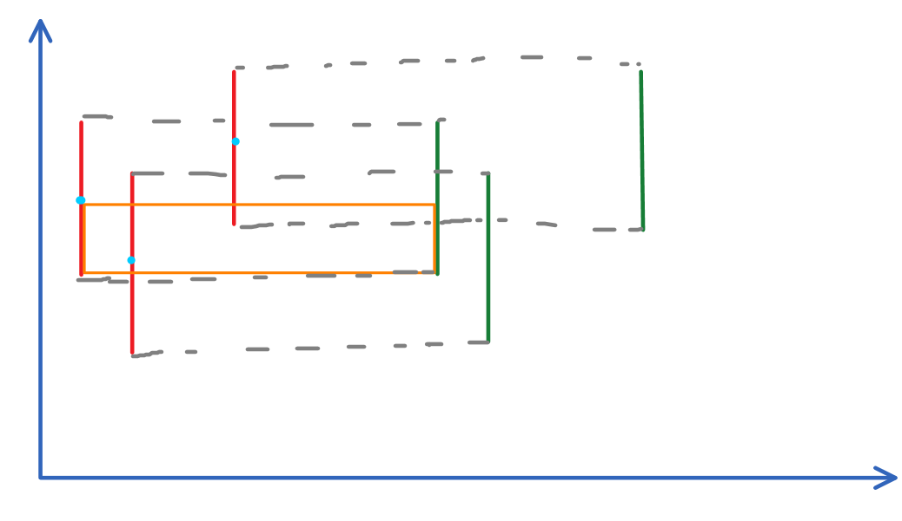

正难则反 非常常见的道理却非常难应用

转化查询和修改, 平衡复杂度往往会有意想不到的效果

<!--more-->

### 懵逼的 题目

[T1](https://www.luogu.org/problemnew/show/P1502)

[T2](https://www.luogu.org/problemnew/show/P1856)

[T3](http://www.lydsy.com/JudgeOnline/problem.php?id=1513)

### 扯淡的 题解

难得题目质量不错, ~~所以~~然而差点爆零

#### T1

感谢舒老师耐心的讲解

我们发现T1单点修改非常简单啊, 但是查询一个矩形非常不资瓷啊, 我们想一想, 这么坑的题怎么会让你只有单点修改这么简单??? 那么, 我们看看区间修改能不能套到这个题上面...

于是我们把一棵星星能影响到当前窗口的区间(纵向)都加上他的亮度, 不能影响当前的窗口后就都减去这个亮度, 这样我们只要查询整个区间的最大值就可以了, 然后上扫描线, 直接滑动窗口就可以搞出一个矩形来, 然后更新答案即可



- 红色代表加上一颗星星的亮度, 绿色代表减去这颗星星的亮度
- 蓝色代表那颗星星
- 灰色虚线表示对齐(OneNote没有内置的虚线差评
- 橙色的矩形代表窗户

1. 一颗星星对答案的影响范围就是上下两个窗户宽的范围, 也就是说窗户只要下边界在红色底端点的上面, 上边界在红色上端点的下面, 就会对这个状态的窗户产生这颗星星亮度的贡献影响
2. 而整个窗口中如果亮度会发生变化, 一定是在有星星看不见, 或者新加入一颗星星的时候, 那么我们只需要在红色和绿色的横坐标处统计亮度和 并 更新答案即可, 复杂度是$\mathrm O(\mathrm T\, n\lg n)$

#### T1代码

```cpp
#include <iostream>
#include <cstdio>
#include <cstring>
#include <cstdlib>
#include <algorithm>
#define MAXN (100000 + 5)
#define LS(dq) ((dq) << 1)
#define RS(dq) (((dq) << 1) | 1)
#define LL long long
using namespace std;
struct node
{
	int le, ri;
	LL maxz, lazy;
}b[MAXN << 3];
struct question
{
	int le, ri, zh, wz;
}q[MAXN];
int n, w, h;
LL sorx[MAXN], sory[MAXN], ans;
void push_up(int dq)
{ b[dq].maxz = max(b[LS(dq)].maxz, b[RS(dq)].maxz); }
void push_down(int dq)
{
	LL& x = b[dq].lazy;
	b[LS(dq)].lazy += x, b[RS(dq)].lazy += x;
	b[LS(dq)].maxz += x, b[RS(dq)].maxz += x;
	x = 0;
}
void js(int dq, int le, int ri)
{
	b[dq].le = le, b[dq].ri = ri, b[dq].maxz = b[dq].maxz = 0;
	if (le == ri)
		return ;
	int mi = (le + ri) >> 1;
	js(LS(dq), le, mi);
	js(RS(dq), mi + 1, ri);
}
void xg(int dq, int le, int ri, int zh)
{
	if (b[dq].le == le && b[dq].ri == ri)
	{
		b[dq].maxz += zh, b[dq].lazy += zh;
		return ;
	}
	push_down(dq);
	int mi = (b[dq].le + b[dq].ri) >> 1;
	if (le > mi)
		xg(RS(dq), le, ri, zh);
	else if (ri <= mi)
		xg(LS(dq), le, ri, zh);
	else
		xg(LS(dq), le, mi, zh), xg(RS(dq), mi + 1, ri, zh);
	push_up(dq);
}
void solve()
{
	int last = n + 1;
	for (int i = 1; i <= n; i++)
	{
		xg(1, q[i].le, q[i].ri, q[i].zh);
		while (q[last].wz + w <= q[i].wz)
			xg(1, q[last].le, q[last].ri, q[last].zh), ++last;
		ans = max(ans, b[1].maxz);
	}
}
bool cmp(question x, question y)
{ return x.wz < y.wz; }
void init()
{
	ans = 0;
	scanf("%d%d%d", &n, &w, &h);
	for (int i = 1; i <= n; i++)
	{
		scanf("%d%d%d", &sorx[i], &sory[i], &q[i].zh);
		q[i].wz = sorx[i], sory[i + n] = q[i].le = sory[i], sory[i] = q[i].ri = sory[i] + h - 1;
		q[i + n] = q[i];
		q[i + n].zh = -q[i].zh;
	}
	sort(sorx + 1, sorx + n + 1);
	sort(sory + 1, sory + (n << 1) + 1);
	sorx[0] = unique(sorx + 1, sorx + n + 1) - sorx - 1;
	sory[0] = unique(sory + 1, sory + (n << 1) + 1) - sory - 1;
	for (int i = 1; i <= (n << 1); i++)
	{
		q[i].le = max(1, (int) (lower_bound(sory + 1, sory + sory[0] + 1, q[i].le) - sory));
		q[i].ri = min(MAXN - 1, (int) (lower_bound(sory + 1, sory + sory[0] + 1, q[i].ri) - sory));
	}
	sort(q + 1, q + n + 1, cmp);
	sort(q + n + 1, q + (n << 1) + 1, cmp);
	js(1, 1, MAXN - 1);
}
int main()
{
	freopen("stars.in", "r", stdin);
	freopen("stars.out", "w", stdout);
	int t = 1;
//	scanf("%d", &t);
	while (t--)
	{
		init();
		solve();
		printf("%lld\n", ans);
	}
	return 0;
}

/*
2
3 5 4
1 2 3
2 3 2
6 3 1
3 5 4
1 2 3
2 3 2
5 3 1
*/
```
#### T2

考试前一天[Steven张](https://www.luogu.org/space/show?uid=52574)dalao刚问我 矩形周长并 && 矩形面积并&& 矩形面积交 的一些问题...我就正好学了一波标记永久化的写法, 发现非常资瓷啊, 写起来非常方便啊...然后第二天就考了...

#### T2代码

注意这时候线段树的叶子节点代表的是一段区间

```cpp
#include <iostream>
#include <cstdio>
#include <cstring>
#include <cstdlib>
#include <algorithm>
#include <vector>
#define MAXN (100000 + 5)
#define MAXJ (10000 + 1)
#define MAXQ ()
#define max(a, b) ((a) > (b) ? (a) : (b))
#define min(a, b) ((a) < (b) ? (a) : (b))
#define abs(a) ((a) < 0 ? (-(a)) : (a))
#define LS(dq) ((dq) << 1)
#define RS(dq) (((dq) << 1) | 1)
using namespace std;
struct node // 叶子[le, le]实际代表线段[le, le + 1] 
{
	int cnt, zh, le, ri; // 那么其实这个节点代表的值是 [le, ri + 1] 
}b[MAXN << 4];
struct que
{
	int x, y, wz, zh;
	que(int a, int b, int w, int c): x(a), y(b), wz(w), zh(c) {}
};
void js(int, int, int);
void push_up(int);
void xg(int, int, int, int);
bool cmp(que, que);
int main()
{
//#define DEBUG
#ifndef DEBUG
	freopen("picture.in", "r", stdin);
	freopen("picture.out", "w", stdout);
#endif
	int n, inf = 0;
	vector<que> qx, qy;
	scanf("%d", &n);
	/*
	从左到右, 从下到上 
				xx, yy
	-------------
	|			|
	|			|
	-------------
	x, y
	*/
	for (int i = 1; i <= n; i++)
	{
		int x, y, xx, yy;
		scanf("%d%d%d%d", &x, &y, &xx, &yy);
		x += MAXJ, y += MAXJ, xx += MAXJ, yy += MAXJ;
		inf = max(inf, max(max(x, y), max(xx, yy)));
		qx.push_back(que(y, yy, x, 1));
		qx.push_back(que(y, yy, xx, -1));
		qy.push_back(que(x, xx, y, 1));
		qy.push_back(que(x, xx, yy, -1));
	}
	sort(qx.begin(), qx.end(), cmp);
	sort(qy.begin(), qy.end(), cmp);
	js(1, 1, inf);
	int ans = 0;
	for (int i = 0; i < qx.size(); i++)
	{
		int last = b[1].zh;
		xg(1, qx[i].x, qx[i].y - 1, qx[i].zh);
		ans += abs(b[1].zh - last);
	}
	js(1, 1, inf);
	for (int i = 0; i < qy.size(); i++)
	{
		int last = b[1].zh;
		xg(1, qy[i].x, qy[i].y - 1, qy[i].zh);
		ans += abs(b[1].zh - last);
	}
	printf("%d", ans);
	return 0;
}
void js(int dq, int le, int ri)
{
	b[dq].le = le, b[dq].ri = ri;
	b[dq].zh = b[dq].cnt = 0;
	if (le == ri)
		return ;
	int mi = (le + ri) >> 1;
	js(LS(dq), le, mi);
	js(RS(dq), mi + 1, ri);
}
void xg(int dq, int le, int ri, int zh)
{
	if (b[dq].le == le && b[dq].ri == ri)
	{
		b[dq].cnt += zh;
		push_up(dq);
		return ;
	}
	int mi = (b[dq].le + b[dq].ri) >> 1;
	if (le > mi)
		xg(RS(dq), le, ri, zh);
	else if (ri <= mi)
		xg(LS(dq), le, ri, zh);
	else
		xg(LS(dq), le, mi, zh), xg(RS(dq), mi + 1, ri, zh);
	push_up(dq);
}
void push_up(int dq)
{
	b[dq].zh = b[LS(dq)].zh + b[RS(dq)].zh;
	if (b[dq].cnt > 0)
		b[dq].zh = (b[dq].ri - b[dq].le + 1);
}
bool cmp(que x, que y)
{
	if (x.wz == y.wz)
		return x.zh > y.zh;
	else
		return x.wz < y.wz;
}

/*
2
1 1 3 3
2 2 4 4


7
-15 0 5 10
-5 8 20 25
15 -4 24 14
0 -6 16 4
2 15 10 22
30 10 36 20
34 0 40 16
*/
```

#### T3

裸的二维线段树 区间覆盖, 区间max

我们发现直接肛二维线段树下发标记非常不资瓷啊...比如我就直接写残了...

然后捏, 我们看(参悟)了看(参悟)[po爷爷的blog](https://blog.csdn.net/PoPoQQQ/article/details/46673953)发现"woc还有这种操作"

...

标记永久化

我们需要维护一个值: `maxz`代表区间的最大值

我们要记录两个标记,:

- 一个`rootdq`代表当前的矩形被完全覆盖的贡献(也就是当前节点代表的矩形$\in$一次修改中的矩形)
- 一个`rootson`代表自己的儿子节点中覆盖的贡献(也就是一次修改中的矩形不必完全覆盖当前节点代表的矩形, 而是覆盖到了当前节点的一个子矩形)

这样, 我们修改的时候, 沿途的节点都修改`rootson`, 最后完美覆盖的节点修改`rootdq`即可

而查询的时候相反, 沿途的节点都查询`rootdq`以更新要查找矩形最大被覆盖的值, 最后完美覆盖的节点查询`rootson`来看子矩形是否被覆盖过更大的值

还是挺妙的对吧?

#### T3代码

出了半天的错, 又WA又T发现是$\max$的锅...

如果这么写$\max$函数: `#define max(a, b) ((a) > (b) ? (a) :(b))`, 然后你又将函数的返回值当成变量放在了`max()`里, 而你的函数又恰好会对某些全局的值造成影响, 你就会发现你的值被改变了两次...$\to \mathrm {GG}$

```cpp
#include <iostream>
#include <cstdio>
#include <cstring>
#include <cstdlib>
#include <algorithm>
#define LS(dq) ((dq) << 1)
#define RS(dq) (((dq) << 1) | 1)
#define fa(dq) ((dq) >> 1)
//#define max(a, b) ((a) > (b) ? (a) : (b))
//#define min(a, b) ((a) < (b) ? (a) : (b))
#define MAXN (10000 + 5)
using namespace std;
struct nodex
{
	int ls, rs, le, ri, maxz, lazy; // [le, ri + 1]
	nodex(): ls(0), rs(0), maxz(0), lazy(0) {}
}bx[MAXN << 8];
struct nodey
{
	int le, ri, lazy, rootdq, rootson; // [le, ri + 1]
	nodey(): lazy(0) {}
}by[MAXN << 3];
int n, d, s;
static int cnt = 0;
inline int newnode(int le, int ri)
{
	bx[++cnt].le = le, bx[cnt].ri = ri;
	return cnt;
}
void jsy(int dq, int le, int ri)
{
	by[dq].le = le, by[dq].ri = ri;
	by[dq].rootdq = newnode(1, d);
	by[dq].rootson = newnode(1, d);
	if (le == ri)
		return ;
	int mi = (le + ri) >> 1;
	jsy(LS(dq), le, mi);
	jsy(RS(dq), mi + 1, ri);
}
int cxx(int dq, int le, int ri)
{
	if (!dq)
		return 0;
	int re = bx[dq].lazy;
	if (bx[dq].le == le && bx[dq].ri == ri)
		return max(re, bx[dq].maxz);
	int mi = (bx[dq].le + bx[dq].ri) >> 1;
	if (le > mi)
		return max(re, cxx(bx[dq].rs, le, ri));
	else if (ri <= mi)
		return max(re, cxx(bx[dq].ls, le, ri));
	else
		return max(re, max(cxx(bx[dq].ls, le, mi), cxx(bx[dq].rs, mi + 1, ri)));
}
int cxy(int dq, int le, int ri, int lx, int rx)
{
	int re = cxx(by[dq].rootdq, lx, rx);
	if (by[dq].le == le && by[dq].ri == ri)
		return max(re, cxx(by[dq].rootson, lx, rx));
	int mi = (by[dq].le + by[dq].ri) >> 1;
	if (ri <= mi)
		return max(re, cxy(LS(dq), le, ri, lx, rx));
	else if (le > mi)
		return max(re, cxy(RS(dq), le, ri, lx, rx));
	else
		return max(re, max(cxy(LS(dq), le, mi, lx, rx), cxy(RS(dq), mi + 1, ri, lx, rx)));
}
void xgx(int& dq, int le, int ri, int zh, int dql, int dqr)
{
	if (!dq)
		dq = newnode(dql, dqr);
	bx[dq].maxz = max(bx[dq].maxz, zh);
	if (dql == le && dqr == ri)
	{
		bx[dq].lazy = max(bx[dq].lazy, zh);
		return ;
	}
	int mi = (dql + dqr) >> 1;
	if (ri <= mi)
		xgx(bx[dq].ls, le, ri, zh, dql, mi);
	else if (le > mi)
		xgx(bx[dq].rs, le, ri, zh, mi + 1, dqr);
	else
		xgx(bx[dq].ls, le, mi, zh, dql, mi), xgx(bx[dq].rs, mi + 1, ri, zh, mi + 1, dqr);
}
void xgy(int dq, int le, int ri, int lx, int rx, int zh)
{
//	if (le > ri)	return ;
	xgx(by[dq].rootson, lx, rx, zh, 1, d);
	if (by[dq].le == le && by[dq].ri == ri)
	{
		xgx(by[dq].rootdq, lx, rx, zh, 1, d);
		return ;
	}
	int mi = (by[dq].le + by[dq].ri) >> 1;
	if (ri <= mi)
		xgy(LS(dq), le, ri, lx, rx, zh);
	else if (le > mi)
		xgy(RS(dq), le, ri, lx, rx, zh);
	else
		xgy(LS(dq), le, mi, lx, rx, zh), xgy(RS(dq), mi + 1, ri, lx, rx, zh);
}
int main()
{
//#define DEBUG
#ifndef DEBUG
	freopen("tet.in", "r", stdin);
	freopen("tet.out", "w", stdout);
#endif
	scanf("%d%d%d", &d, &s, &n);
	jsy(1, 1, s);
	for (int i = 1; i <= n; i++)
	{
		int chang, kuan, gao, x, y, xx, yy;
		scanf("%d%d%d%d%d", &chang, &kuan, &gao, &x, &y);
		++x, ++y;
		xx = x + chang, yy = y + kuan;
//		printf("case #%d: HI~ x: %d, xx: %d, y: %d, yy: %d, le: %d\n", i, x, xx, y, yy, by[1].le);
		int maxh = cxy(1, y, yy - 1, x, xx - 1);
//		printf("case #%d: %d x: %d, xx: %d, y: %d, yy: %d, le: %d\n", i, maxh, x, xx, y, yy, by[1].le);
		xgy(1, y, yy - 1, x, xx - 1, maxh + gao);
//		printf("case #%d: %d\n", i, by[1].le);
//		printf("case #%d: %d\n", i, cnt);
	}
	printf("%d", cxy(1, 1, s - 1, 1, d - 1));
	return 0;
}

/*
7 5 4
4 3 2 0 0
3 3 1 3 0
7 1 2 0 3
2 3 3 2 2
*/
```

By 险些爆零并疯狂$\bmod (AKfun + TreeLovesWater)$的 Cansult