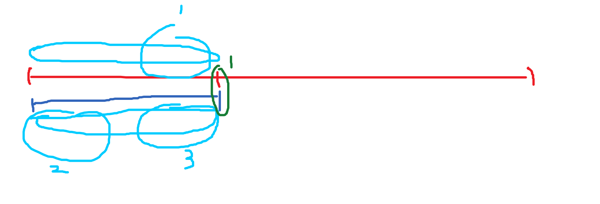

今天正好xMinh问我KMP的实现来着...于是我就带着下面这首**带劲的bgm**给他讲了一下下...正好当补个档吧

~~做了一点微小的贡献 bgm请点开全文~~

<!--more-->

<iframe frameborder="no" border="0" marginwidth="0" marginheight="0" width=330 height=86 src="//music.163.com/outchain/player?type=2&id=548408261&auto=0&height=66"></iframe>

↑彻底确定了我 slyz逗逼担当的地位


kmp靠的就是

> 智慧~ 大智慧~ 不一样的智慧~


请试想我以上图的姿态给xMinh讲KMP对其造成的心理阴影面积

### 沙茶的 KMP不详解(代码)


KMP可以以$\mathrm O(n + m)$的复杂度解决字符串的匹配问题

在普通的字符串匹配中, $B$串一旦在某一位(比如说第$i$位)上与$A$不一样, 就需要从头开始匹配$B$串, 这样最坏的复杂度是$\mathrm O(m n)$的

优化的一般思想都是利用重复的信息, 我们发现, 既然$B$在第$i$位与$A$失配了, 那么其实$B$的前$i - 1$位都是和$A$匹配的, 我们可以利用这个来优化

直接讲代码吧...xMinh说主要就是代码不懂...

代码是去年写的...那时候还似懂非懂来着...然后码风也比较...清新...

#### 预处理

$p[i]$的意义: 在$B$的前$i$位, 最长的[前缀与后缀相等的长度], 
也就是$(b[0] \to b[p[i]]) = (b[i - p[i]] \to b[i - 1])$ (不要在意边界...大体意思懂了就好... = =+)

```cpp
n=strlen(a);
m=strlen(b);
p[0]=p[1]=0;
int j=0; // p[i]: (b[0] ~ b[p[i]]) = (b[i - p[i]] ~ b[i - 1])
for(int i=1;i<m;i++)
{
	j=p[i]; // 
	while(j&&b[j]!=b[i])	j=p[j];
	p[i+1]=(b[i]==b[j])?(j+1):0;
}
```

这个是什么意思呢...我们在预处理$p[]$...但是怎么预处理呢...肯定不能直接暴力匹配...那就$n^2$了是不...

##### $j = p[i]$


上图中, 蓝色的部分是已经确定的 前缀 == 后缀 长度, 当前匹配的是绿色的部分, 后半部分的绿色点是$i++$后得到的
, 前面的绿色点是$j = p[i]$得到的

现在就是要匹配第$i$位和第$j$位, 如果能匹配成功当然好, 直接把$p[i + 1] = p[i] + 1$即可

##### $while (j \&\& b[j] != b[i]) \,\, j = p[j]$


如果匹配失败, 我们发现既然我们已经知道前$j$位的$p$, 也就是紫色的1部分和2部分相等, 而两个蓝色的部分是相等的, 所以2和3是相等的, 也就是
$$
\begin{cases}
1 = 2 \\
2 = 3 \\
\end{cases}
\to \,\, 1 = 3
$$
所以我们惊喜的发现, 1和3其实是相等的, 没有必要再去匹配了...我们可以直接匹配第$j$位和第$i$位, 如果不匹配, 可以继续类似递归一样继续下去...

```cpp
n=strlen(a);
m=strlen(b);
p[0]=p[1]=0;
int j=0; // p[i]: (b[0] ~ b[p[i]]) = (b[i - p[i]] ~ b[i - 1])
for(int i=1;i<m;i++)
{
	j=p[i]; // j是当前应该和i(也就是当前长度字符串结尾)匹配的位
	while(j&&b[j]!=b[i])	j=p[j]; // 类似递归的处理过程, 知道递归到最底层无法递归: j回到开头了
	p[i+1]=(b[i]==b[j])?(j+1):0;
}
```

↑再粘一遍加深一下印象

#### 匹配

终于到了激动人心的匹配...

```cpp
j=0;
for(int i=0;i<n;i++)
{
	while(j&&a[i]!=b[j])	j=p[j];
	if(b[j]==a[i])	j++;
	if(j==m)
	{
		printf("%d\n",i-m+2);
		j=p[j];
	}
}
```

##### $while (j \&\&a[i] != b[j])\,\, j = p[j]$



当前在匹配绿色的1, 然后如果失配了...

我们发现
$$
\begin{cases}
1 = 3 \\
2 = 3
\end{cases}
\to \,\, 1 = 2
$$
于是我们又省了一堆匹配...直接从2的结尾开始匹配绿色的1就好了

##### $j=p[j]$

不得不说...xMinh跟我说不理解这个地方的时候还是挺吃惊的...这个的意思呢, 就是你kmp匹配, 不能光找出第一个匹配的串啊, 还得找出来后面那些是匹配的啊

其实这里就是把他当失配, 来尽快的找后一个可以匹配的串

也就是相当于两个串变成了下面这样: 


懂了?

### 例题

#### [简单水题](https://www.luogu.org/problemnew/show/P3375)

```cpp
#include<bits/stdc++.h>
#define MAXN 1000000+5
#define MAXM 1000+5
using namespace std;
char a[MAXN],b[MAXM];
int n,m;
int p[MAXM];
int main()
{
	scanf("%s",a);
	scanf("%s",b);
	n=strlen(a);
	m=strlen(b);
	p[0]=p[1]=0;
	int j=0; // p[i]: (b[0] ~ b[p[i]]) = (b[i - p[i]] ~ b[i - 1])
	for(int i=1;i<m;i++)
	{
		j=p[i]; // 
		while(j&&b[j]!=b[i])	j=p[j];
		p[i+1]=(b[i]==b[j])?(j+1):0;
	}
	/*for(int i=0;i<m;i++)
	{
		cout<<p[i]<<" ";
	}
	cout<<endl;*/
	j=0;
	for(int i=0;i<n;i++)
	{
		while(j&&a[i]!=b[j])	j=p[j];
		if(b[j]==a[i])	j++;
		if(j==m)
		{
			printf("%d\n",i-m+2);
			j=p[j];
		}
	}
	for(int i=1;i<=m;i++)
	{
		printf("%d ",p[i]);
	}
	return 0;
}
```

#### [脑洞进阶](https://www.cansult.ga/2911.html)

见我的blog吧...

反正我当时没有想出来[苦笑]...


By 沙茶 Cansult