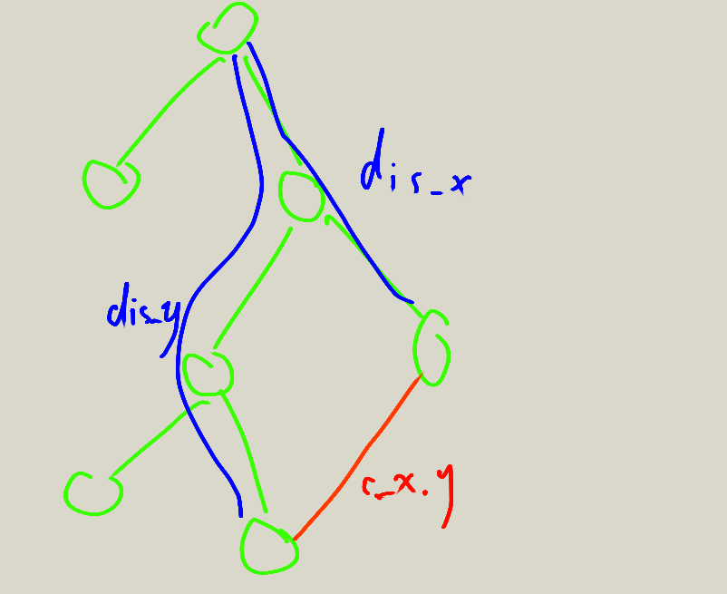

这个世界是不是就我堆优化$Dijkstra$忘了用优先队列了...

<!--more-->

## 懵逼的 题目

[...](https://www.lydsy.com/JudgeOnline/problem.php?id=1576)

## 扯淡的 题解

感觉我好像对删边这种东西不是很会...~~其实是啥都不会~~

先跑出最短路, 建出最短路树(就是每一个节点和更新他的节点连边), 每个点到根的距离就是他到节点$1$的最短路

然后就会有树边和非树边, 我们发现加入一条非树边后, 就能表示出$ans_z = dis_x + dis_y +c_{x, y} | z \in \text{x到y的路径上除去LCA的点}$

那我们怎么找这个要更新的$c_{x, y}$呢, 我们又发现对于每一条路径能更新的点$z$来说$dis_z$是不会变的, 影响答案大小的只有$dis_x + dis_y + c_{x, y}$, 那我们只需要把所有的非树边都按照这个东西排序, 然后就可以从小到大更新了, 第一次更新点$z$的答案也一定是最有的答案

更新答案有两种方法, 树剖和并查集, 因为每个点只会更新一次, 所以我们可以把更新过的点缩到LCA上, 然后更新的时候一步步往上爬就行了





## 沙茶的 代码

```cpp
/**************************************************************
    Problem: 1576
    User: Cansult
    Language: C++
    Result: Accepted
    Time:1256 ms
    Memory:26528 kb
****************************************************************/
 
#include <iostream>
#include <cstdio>
#include <cstring>
#include <queue>
#include <algorithm>
#define MAXN (100000 + 5)
#define MAXM (500000 + 5)
#define INF (0x7ffffff)
#define pii pair<int, int>
using namespace std;
struct edg
{
    int from, to, next, cost;
}b[MAXM << 1], rb[MAXM];
struct cmp
{
    bool operator () (const pii x, const pii y)
    { return x.second > y.second; }
};
int g[MAXN], cntb, n, m, pre[MAXN], dis[MAXN], deep[MAXN];
bool vis[MAXN];
priority_queue<pii, vector<pii>, cmp> q;
void adn(int from, int to, int cost)
{
    b[++cntb].next = g[from];
    b[cntb].from = from, b[cntb].to = to, b[cntb].cost = cost;
    g[from] = cntb;
}
void dijk()
{
    memset(vis, false, sizeof(vis));
    memset(dis, 0x7f, sizeof(dis));
    q.push(make_pair(1, dis[1] = 0));
    deep[1] = 1;
    while (!q.empty())
    {
        pii dq = q.top();
        q.pop();
        if (vis[dq.first])
            continue;
        vis[dq.first] = true;
        for (int i = g[dq.first]; i; i = b[i].next)
            if (dis[b[i].to] > dq.second + b[i].cost)
            {
                dis[b[i].to] = dq.second + b[i].cost;
                pre[b[i].to] = dq.first;
                deep[b[i].to] = deep[dq.first] + 1;
                q.push(make_pair(b[i].to, dis[b[i].to]));
            }
    }
}
bool cmp1(edg x, edg y)
{ return x.cost < y.cost; }
void solve(edg e)
{
    int x = e.from, y = e.to;
    while (x != y)
    {
        if (deep[x] < deep[y])
            swap(x, y);
        if (!vis[x])
            dis[x] = e.cost - dis[x];
        vis[x] = true;
        x = pre[x];
    }
    while (e.from != x)
    {
        int bf = e.from;
        e.from = pre[e.from];
        pre[bf] = x;
    }
    while (e.to != x)
    {
        int be = e.to;
        e.to = pre[e.to];
        pre[be] = x;
    }
}
int main()
{
    scanf("%d%d", &n, &m);
    for (int i = 1; i <= m; i++)
    {
        scanf("%d%d%d", &rb[i].from, &rb[i].to, &rb[i].cost);
        adn(rb[i].from, rb[i].to, rb[i].cost);
        adn(rb[i].to, rb[i].from, rb[i].cost);
    }
    dijk();
    for (int i = 1; i <= m; i++)
        if (dis[rb[i].from] < INF)
            rb[i].cost += dis[rb[i].from] + dis[rb[i].to];
        else
            rb[i].cost = INF;
    sort(rb + 1, rb + m + 1, cmp1);
    memset(vis, false, sizeof(vis));
    for (int i = 1; i <= m; i++)
        if (dis[rb[i].from] < INF && pre[rb[i].to] != rb[i].from && pre[rb[i].from] != rb[i].to)
            solve(rb[i]);
    for (int i = 2; i <= n; i++)
        if (dis[i] < INF && vis[i])
            printf("%d\n", dis[i]);
        else
            puts("-1");
    return 0;
}
 
/*
4 5
1 2 2
1 3 2
3 4 4
3 2 1
2 4 3
*/
```

By 药丸的 Cansult