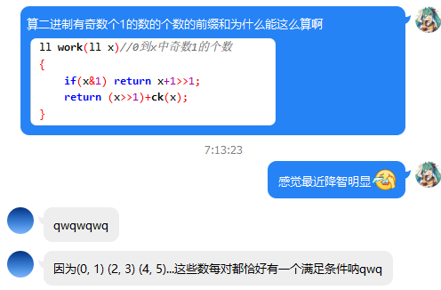

情况一定要考虑全面...

<!--more-->

### 懵逼的 题目

[...](http://www.zhengruioi.com/problem/246)

### 扯淡的 题解

比赛的时候写了一个线段树求区间并再加上区间数位DP...感觉自己肥肠dio然后一分没有

先是全局的`LL`数组被`int`屏蔽了...我也不知道咋想的...

然后又发现我漏了一种情况就是两个不相交的区间也会对答案产生贡献...

后来我抄敦爷爷题解发现直接分别记录当前区间并中数位`1`的个数为奇数和偶数的数的个数然后再乘起来就行了...

再后来我发现我不会求这个玩意...然后参悟了一波大爷的代码



...行吧...

### 沙茶的 代码

```cpp
#include "pch.h"
#include <iostream>
#include <cstdio>
#include <cstring>
#include <cstdlib>
#include <algorithm>
#include <vector>
#define LL long long
#define MAXK (32 + 5)
#define MAXN (500000 + 5)
#define INF (0x7fffffff)
#define pii pair<LL, LL>
#define LS(dq) ((dq) << 1)
#define RS(dq) (((dq) << 1) | 1)
using namespace std;
struct node
{
	int le, ri, zh, lazy;
}b[MAXN << 2];
int n;
LL sora[MAXN << 1];
vector<int> cov;
pii a[MAXN];
void push_up(int dq)
{
	if (b[LS(dq)].zh == b[RS(dq)].zh)		b[dq].zh = b[LS(dq)].zh;
	else	b[dq].zh = -1;
}
void push_down(int dq)
{
	b[LS(dq)].zh = b[RS(dq)].zh = b[LS(dq)].lazy = b[RS(dq)].lazy = b[dq].lazy;
	b[dq].lazy = 0;
}
void js(int dq, int le, int ri)
{
	b[dq].zh = 0, b[dq].le = le, b[dq].ri = ri, b[dq].lazy = 0;
	if (le == ri)	return;
	int mi = (le + ri) >> 1;
	js(LS(dq), le, mi);
	js(RS(dq), mi + 1, ri);
}
int cx(int dq, int wz)
{
	if (b[dq].le == b[dq].ri)
		return b[dq].zh;
	int mi = (b[dq].le + b[dq].ri) >> 1;
	if (b[dq].lazy)
		push_down(dq);
	if (wz > mi)
		return cx(RS(dq), wz);
	return cx(LS(dq), wz);
}
void xg(int dq, int le, int ri, int zh)
{
	if (b[dq].le == le && b[dq].ri == ri)
	{
		b[dq].zh = b[dq].lazy = zh;
		return;
	}
	int mi = (b[dq].le + b[dq].ri) >> 1;
	if (b[dq].lazy)
		push_down(dq);
	if (le > mi)
		xg(RS(dq), le, ri, zh);
	else if (ri <= mi)
		xg(LS(dq), le, ri, zh);
	else
		xg(LS(dq), le, mi, zh), xg(RS(dq), mi + 1, ri, zh);
	push_up(dq);
}
void cx2(int dq, int le, int ri)
{
	if (b[dq].zh && b[dq].zh != -1)
	{
		cov.push_back(b[dq].zh);
		return;
	}
	if (b[dq].le == b[dq].ri)
		return;
	int mi = (b[dq].le + b[dq].ri) >> 1;
	if (b[dq].lazy)
		push_down(dq);
	if (le > mi)
		cx2(RS(dq), le, ri);
	else if (ri <= mi)
		cx2(LS(dq), le, ri);
	else
	{
		if (b[LS(dq)].zh)
			cx2(LS(dq), le, mi);
		if (b[RS(dq)].zh)
			cx2(RS(dq), mi + 1, ri);
	}
}
bool is1(LL x)
{
	int re = 0;
	for (int i = 32; i >= 0; i--)
		if (x & (1 << i))
			++re;
	return (re & 1);
}
LL cal(LL x)
{
	if (x & 1)
		return (x + 1) >> 1;
	else
		return (x >> 1) + is1(x);
}
LL cal1(int i) // 0, 1; 2, 3; 4, 5;
{
	return (cal(sora[a[i].second]) - cal(sora[a[i].first] - 1));
}
LL cal0(int i)
{
	return (sora[a[i].second] - sora[a[i].first] + 1) - cal1(i);
}
void solve()
{
	a[0].first = INF, a[0].second = -INF;
	js(1, 1, sora[0]);
	LL ans1 = 0, ans0 = 0;
	for (int i = 1; i <= n; i++)
	{
		int left = min(a[i].first, a[cx(1, a[i].first)].first), right = max(a[i].second, a[cx(1, a[i].second)].second);
		cov.clear();
		cx2(1, left, right);
		sort(cov.begin(), cov.end());
		cov.erase(unique(cov.begin(), cov.end()), cov.end());
		for (int j = 0; j < cov.size(); j++)
			ans1 -= cal1(cov[j]), ans0 -= cal0(cov[j]);
		xg(1, left, right, i);
		a[i].first = left, a[i].second = right;
		//printf("%d: %lld %lld\n", i, ans1, ans0);
		ans1 += cal1(i), ans0 += cal0(i);
		//printf("%d: %lld %lld\n", i, ans1, ans0);
		printf("%lld\n", ans0 * ans1);
	}
}
int main()
{
	scanf("%d", &n);
	for (int i = 1; i <= n; i++)
		scanf("%lld%lld", &a[i].first, &a[i].second), sora[++sora[0]] = a[i].first, sora[++sora[0]] = a[i].second;
	sort(sora + 1, sora + sora[0] + 1);
	sora[0] = unique(sora + 1, sora + sora[0] + 1) - sora - 1;
	for (int i = 1; i <= n; i++)
		a[i].first = lower_bound(sora + 1, sora + sora[0] + 1, a[i].first) - sora, a[i].second = lower_bound(sora + 1, sora + sora[0] + 1, a[i].second) - sora;
	solve();
	return 0;
}


/*
8
68 69
14 15
64 64
17 24
67 76
37 54
27 32
45 56

1
4
6
42
110
380
506
550
*/
```

By 联赛钦定爆零的 Cansult