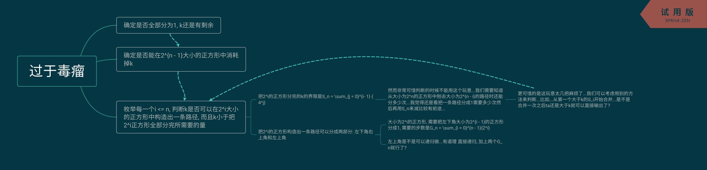

参悟完大爷们的代码感觉灵魂得到了升华

比赛的时候总是走神有点蛋疼

<!--more-->

ABC肥肠水...D没读懂题...后来gayge告诉我题的时候就剩20min了...不过后来的事实证明就是读懂题了1H也还是不够我倒腾的...

### [D. Olya and magical square](https://codeforces.com/contest/1080/problem/D)

题意是给一个边长为$2^n$的正方形 每一次分割把正方形等分为4份, 问分$k$次后是否能有一条从左下到右上的路径(边相连), 路径上的正方形大小相等, 要求输出路径上正方形大小对2的对数; $n, k \in \mathrm {long long}$




大体就是上面那玩意...先判断能不能在右下角的$2^{n - 1}$正方形中分完$k$; 如果不能 就看看整个$2^n$的正方形能不能用恰好$k$次分完; 再不能判断出来 就假设路径上的正方形大小是最后分完的正方形中最小的, 枚举这个大小并判断; 再不能判断 就说明路径上的正方形比其他正方形要大, 可以看做先把初始正方形分完 然后再在左上角减少分割次数 合并出一条路径, 只需要看看$k$是否足够小, 能不能合并出来就行了

写自闭了...估计有更简单的方法 有空再参悟一下大爷们的代码...

```cpp
#include <iostream>
#include <cstdio>
#define INF (1000000000000000000ll + 5)
#define MAXN (100000 + 5)
#define LL unsigned long long
using namespace std;
LL S[MAXN], GG[MAXN], G[MAXN]; // S[i]: 把大小为2^i的正方形分割至1需要的步数; GG[i]: 把大小为2^i的正方形分割至正方形长度为1组成的拐角需要的步数; G[i]: 把大小为2^i的正方形分割至长度为1组成的竖线或横线需要的步数
void init() {
	LL x = 1;
	for (int i = 1; i < MAXN && S[i] < INF; i++)	S[i] = S[i - 1] + x, x *= 4;
	x = 1;
	for (int i = 1; i < MAXN && G[i] < INF; i++)	G[i] = G[i - 1] + x, x <<= 1;
	for (int i = 1; i < MAXN && GG[i] < INF; i++)	GG[i] = GG[i - 1] + G[i - 1] * 2 + 1;
}
void solve(LL n, LL k) {
	for (int i = 0; i < MAXN; i++) {
		if (k - 1 <= S[i])
			if (i <= n - 1) {
				printf("YES %llu\n", n - 1);
				return ;
			}
		if (k == S[i]) {
			if (i > n)
				puts("NO");
			else if (i == n)
				puts("YES 0");
			return ;
			}
	}
	for (int i = 1; i <= n; i++)
		if (k >= GG[i] && k <= S[i]) {
			printf("YES %llu\n", n - i);
			return ;
		}
	if (n == 1)
		puts((k > 1) ? "NO" : "YES 1");
	else if (k <= S[n] - 2 * (1 << (n - 1)) + 1)
		puts("YES 1");
	else
		puts("NO");
	return ;
}
int main() {
	init();
	/*
	for (int i = 1; i <= 8; i++) printf("%llu ", S[i]);
	puts("");
	for (int i = 1; i <= 8; i++) printf("%llu ", GG[i]);
	puts("");
	*/
	int t;
	scanf("%d", &t);
	while (t--) {
		LL n, k;
		scanf("%llu%llu", &n, &k);
		solve(n, k);
	}
}
```

### [E. Sonya and Matrix Beauty](https://codeforces.com/contest/1080/problem/E)


```cpp

```


### [F. Katya and Segments Sets](https://codeforces.com/contest/1080/problem/F)

妈耶这题就更有意思了

给$k$个线段, 每个线段属于一个集合, 共有$n$个集合, 有$m$个询问, 每次询问编号在$[a, b]$中的集合, 是否都至少有一个线段$[le, ri]$满足$x \le le \le ri \le y$; 要求$(m + k) \lg n$做法, 强制在线

我一开始的思路大概是行是数轴列是集合然后二维线段树云云 后来参悟了[rnk1大爷的代码](https://codeforces.com/contest/1080/submission/46161976)发现我就是个弟弟OrzOrz


大体就是这样...OrzOrz 

(实现起来好像固定右端点方便一点这里就反着写了...)

把坐标离散化后按照线段所属建主席树, 根的编号为线段的右端点离散后的坐标; 节点所存储的值是区间内最小的值, 代表当前节点所代表的集合区间中, 固定右端点时最靠左的左端点的位置; 初始坐标都为$0$, 每次插入一个线段 从线段右端点坐标所在的根向下走, 直到递归的区间为$[\text{线段所在的集合编号}, \text{线段所在的集合编号}]$, 往大里更新左端点的值; 查询的时候就固定右端点, 找区间内最小的左端点, 然后再和$x$比较一下就完事了;

我认为比较难想到的是如果集合中没有右端点符合条件的线段 他的值就会为$0$, 从而导致整个区间的最小值(也就是最靠左的左端点)为$0$, 而这一定是不满足要求的, 肥肠的妙啊 = =

~~这样的做法甚至支持带修改啊 Excited!~~

**PS**: 代码写起来还是有一点具体的问题的...就是如果像我这么写的话由于同一个节点会在插入时访问多次可能会出现一个情况: 这个节点在之前的修改中已经被赋成`b[pre].ls`或者`b[pre].rs`了, 然而现在又要修改这个点所在的区间, 如果直接修改就会修改到ta的`pre`上去了...所以我加了一个`bool isl`代表这个节点是否曾经被赋为`pre`...

还是要使劲Orz一番在比赛时写出来的大爷 顺便这题有60+测试点...真几把刺激

```cpp
#include <iostream>
#include <cstdio>
#include <cstring>
#include <cstdlib>
#include <algorithm>
#define MAXN (100000 + 5)
#define MAXR (300000 + 5)
using namespace std;
struct seg {
	int le, ri, belong;
}a[MAXR];
struct node {
	int ls, rs, zh, le, ri;
}b[MAXR << 6];
int root[MAXR], n, m, k, sora[MAXR], cntb;
void js(int pre, int& dq, int le, int ri, int wz, int zh, bool isl) { // 可能会出现一点问题...就是之前已经赋为b[pre].ls || b[ore].rs了, 现在又需要新建点就有点蛋疼了...
	if (!dq || isl)	b[dq = ++cntb].le = le, b[dq].ri = ri;
	if (le == ri) {
		b[dq].zh = max(zh, max(b[dq].zh, b[pre].zh));
		return ;
	}
	int mi = (le + ri) >> 1;
	if (wz > mi)	b[dq].ls = (b[dq].ls ? b[dq].ls : b[pre].ls), js(b[pre].rs, b[dq].rs, mi + 1, ri, wz, zh, b[dq].rs == b[pre].rs);
	else	b[dq].rs = (b[dq].rs ? b[dq].rs : b[pre].rs), js(b[pre].ls, b[dq].ls, le, mi, wz, zh, b[dq].ls == b[pre].ls);
	b[dq].zh = min(b[b[dq].ls].zh, b[b[dq].rs].zh);
}
int cx(int rdq, int le, int ri) {
	if (!rdq)	return 0;
	if (b[rdq].le == le && b[rdq].ri == ri)	return b[rdq].zh;
	int mi = (b[rdq].le + b[rdq].ri) >> 1;
	if (le > mi)	return cx(b[rdq].rs, le, ri);
	else if (ri <= mi)	return cx(b[rdq].ls, le, ri);
	else	return min(cx(b[rdq].ls, le, mi), cx(b[rdq].rs, mi + 1, ri));
}
bool cmp(seg x, seg y) { return x.ri < y.ri; }
int main() {
	scanf("%d%d%d", &n, &m, &k);
	for (int i = 1; i <= k; i++) {
		scanf("%d%d%d", &a[i].le, &a[i].ri, &a[i].belong);
		sora[++sora[0]] = a[i].ri;
	}
	sort(sora + 1, sora + sora[0] + 1);
	sort(a + 1, a + k + 1, cmp);
	sora[0] = unique(sora + 1, sora + sora[0] + 1) - sora - 1;
	for (int i = 1; i <= k; i++) {
		a[i].ri = lower_bound(sora + 1, sora + sora[0] + 1, a[i].ri) - sora;
		js(root[a[i].ri - 1], root[a[i].ri], 1, n, a[i].belong, a[i].le, a[i].ri != a[i - 1].ri);
	}
	for (int i = 1, sra, srb, srx, sry; i <= m; i++) {
		scanf("%d%d%d%d", &sra, &srb, &srx, &sry);
		puts((cx(root[upper_bound(sora + 1, sora + sora[0] + 1, sry) - sora - 1], sra, srb) >= srx) ? "yes" : "no");
		fflush(stdout);
	}
	return 0;
}

```

By 准备退役旅游的Cansult