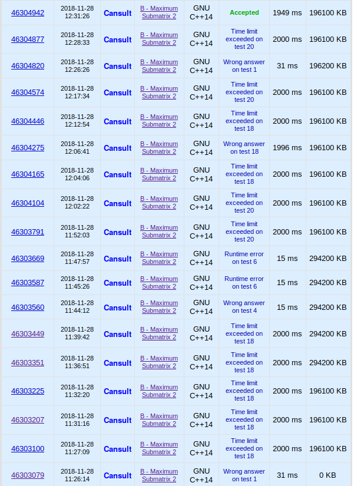

大哥我错了我再也不想着$n^2\lg n$过$5000$了

别说$n^2\lg n$了, $n^2$都过不去

<!--more-->

### 懵逼的 题目

[CF](https://codeforces.com/contest/375/problem/B)

题意: 给一个可以交换行的01矩阵, 要求求出最大的全1子矩阵; 要求复杂度$\mathrm O(\text{常数较小的}n^2)$

### 扯淡的 题解

一开始写的是固定子矩阵的左边, 然后二分找每一行能全1到达的最右边的位置, 给位置从大到小排序, 然后从上到下和普通的全1矩阵做法一样 更新答案就行了

然后T了

然后发现每个点能到达的最右边的位置可以预处理, 于是把二分换成了预处理

然后还是T的

然后就把`sort`改成了基数排序

然后还是T了

最后加了快读, 趁测评机一个不注意`1949ms(2000ms)`

### 沙茶的 代码




```cpp
#include <iostream>
#include <cstdio>
#include <cstring>
#include <cstring>
#include <algorithm>
#define MAXN (5000 + 5)
#define rint register int
#define cint const int
using namespace std;
int n, m, a[MAXN][MAXN], ans, sora[MAXN], sorf[MAXN][MAXN], ton[MAXN];
inline int max(cint x, cint y) { return (x > y) ? x : y; }
void msort(cint x) {
	for (rint i = 1; i <= n; ++i)	++ton[sorf[i][x]];
	int tot = 0;
	for (rint i = m; i >= 0; --i) 
		if (ton[i]){
			tot += ton[i];
			ans = max(ans, i * tot);
			ton[i] = 0;
			if (tot == n)
				return ;
		}
}
void solve() {
	for (rint i = 1; i <= m; ++i) 
		msort(i);
	printf("%d", ans);
}
int read() {
	rint re = 0;
	register char x = 0;
	while (x < '0' || x > '9')
		x = getchar();
	while (x <= '9' && x >= '0')
		re = (re << 1) + (re << 3) + x - '0', x = getchar();
	return re;
}
int read01() {
	register char x = 0;
	while (x != '0' && x != '1')	x = getchar();
	return x - '0';
}
int main() {
	n = read(), m = read();
	for (rint i = 1; i <= n; ++i)
		for (rint j = 1; j <= m; ++j)
			a[i][j] = read01();
	for (rint i = 1; i <= n; ++i)
		for (rint j = m, last = 0; j >= 1; --j)
			if (!a[i][j])
				last = 0;
			else {
				if (!last)	last = j;
				sorf[i][j] = last - j + 1;
			}
	solve();
	return 0;
}
```

By 准备退役旅游的Cansult