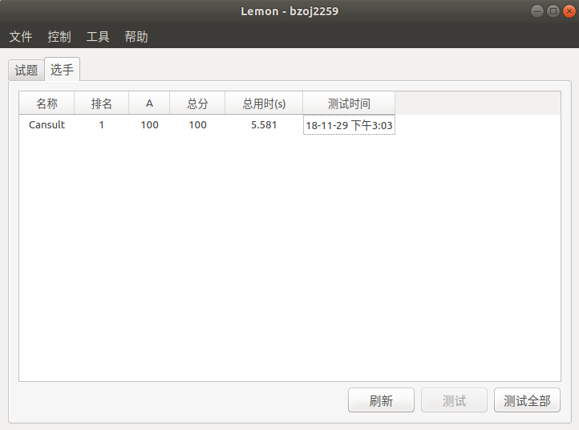

原来$0$是自然数啊...= =+

<!--more-->

### 懵逼的 题目

[BZOJ](https://www.lydsy.com/JudgeOnline/problem.php?id=2259)

### 扯淡的 题解

设$f_i$为以$i$为开头到终点最小的代价

为了计算代价, 需要在线段树中把值赋为$f_i + i$或者$f_i + n - i + 1$

然后分别在`i + a[i] + 1`的左边和右边找最小值再加加减减一下就行了...

然后$\mathrm O(n\lg n)$被卡了...远古神仙WJMZBMR说有$\mathrm O(n)$做法...然而不会...也没找到...

### 沙茶的 代码

一开始以为$0​$不是自然数RE了好久...



```cpp
#include <iostream>
#include <cstdio>
#include <cstring>
#define MAXN (1000000 + 5)
#define INF (2000000000)
#define lowbit(x) ((x) & (-(x)))
#define LS(dq) ((dq) << 1)
#define RS(dq) (((dq) << 1) | 1)
#define rint register int
#define cint const int 
using namespace std;
struct node {
	int le, ri, zh;
}b1[MAXN << 2], b2[MAXN << 2];
int n, a[MAXN], f[MAXN];
inline int max(cint x, cint y) { return (x > y) ? x : y; }
inline int min(cint x, cint y) { return (x < y) ? x : y; }
void js(node* b, cint dq, cint le, cint ri) {
	b[dq].le = le, b[dq].ri = ri;
	b[dq].zh = INF;
	if (le == ri)	return ;
	cint mi = (le + ri) >> 1;
	js(b, LS(dq), le, mi);
	js(b, RS(dq), mi + 1, ri);
}
void xg(node* b, cint dq, cint wz, cint zh) {
	if (b[dq].le == b[dq].ri) {
		b[dq].zh = min(zh, b[dq].zh);
		return ;
	}
	cint mi = (b[dq].le + b[dq].ri) >> 1;
	if (wz <= mi)	xg(b, LS(dq), wz, zh);
	else	xg(b, RS(dq), wz, zh);
	b[dq].zh = min(b[LS(dq)].zh, b[RS(dq)].zh);
}
int cx(node* b, cint dq, cint le, cint ri) {
	if (b[dq].le == le && b[dq].ri == ri)
		return b[dq].zh;
	cint mi = (b[dq].le + b[dq].ri) >> 1;
	if (ri <= mi)	return cx(b, LS(dq), le, ri);
	else if (le > mi)	return cx(b, RS(dq), le, ri);
	else	return min(cx(b, LS(dq), le, mi), cx(b, RS(dq), mi + 1, ri));
}
void solve() {
	++n;
	js(b1, 1, 1, n), js(b2, 1, 1, n);
	xg(b1, 1, n, n), xg(b2, 1, n, 1);
	for (rint i = n - 1; i >= 1; i--) {
	//	printf("%d %d\n", i, a[i]);
		if (i + a[i] + 1 <= n)	f[i] = min(cx(b1, 1, i + a[i] + 1, n) - i - a[i] - 1, cx(b2, 1, i + 1, i + a[i] + 1) + i + a[i] - n);//, printf("ok %d\n", i);
		else	f[i] = cx(b2, 1, i + 1, n) + i + a[i] - n;//, printf("ok %d\n", i);
		xg(b1, 1, i, f[i] + i);
//		printf("ok %d\n", i);
		xg(b2, 1, i, f[i] + n - i + 1);
//		printf("ok %d\n", i);
	}
}
inline int read() {
	int re = 0;
	char x = 0;
	while (x > '9' || x < '0')	x = getchar();
	while (x <= '9' && x >= '0')	re = (re << 1) + (re << 3) + x - '0', x = getchar();
	return re;
}
int main() {
	freopen("data.in", "r", stdin);
	n = read();
	for (rint i = 1; i <= n; i++)	a[i] = read();
	solve();
	printf("%d", f[1]);
	return 0;
}

```

By 准备退役旅游的Cansult