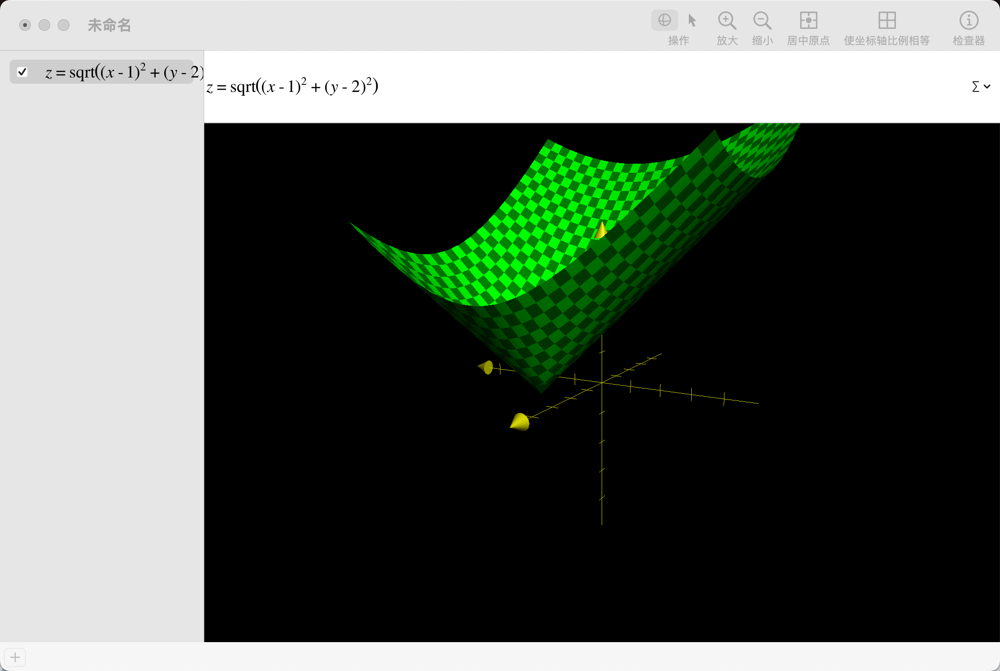
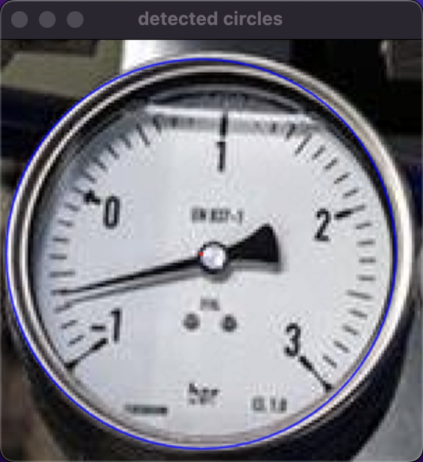
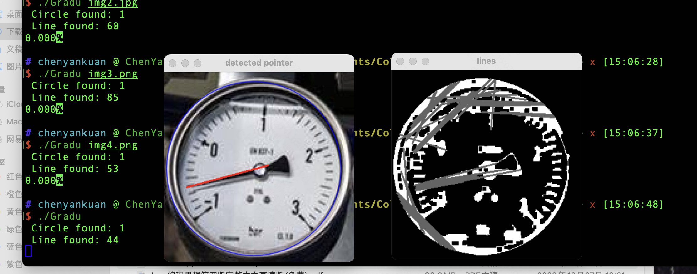

做毕设，留个记录

<!--more-->

总的思路大概就是先用yolo识别出所有表盘

1. 指针式的拉伸成正方形，做 Hough 圆检测裁出表盘，做直线检测找出指针，把表盘周围拉成直线，找出刻度范围，给出指针所在的量程占比
2. 数字式的大概要做 crnn ，晚点再说吧

### Hough 直线检测

在图像上识别出直线，即给一些离散的点，求出直线的方程，~~懂了 回归直线~~（回归分析无法处理多条直线，而且计算复杂）

$$
y = kx + b
$$

具体思路是从 $[x, y]$ 空间转换到 $[k, b]$ 空间，把点 $(x_0, y_0)$ 映射为直线 $b = -  x_0k + y_0$ ，源空间直线上的点映射出的直线的交点 $(k_0, b_0)$ 就是源直线的参数了，多个交点说明有多条直线，交点的范围说明直线的粗细等等。

`opencv` 接口：

```cpp
HoughLinesP(dst, lines, 1, CV_PI / 180, 80, dst.rows / 5, dst.rows / 60);
// 处理的图片，返回结果 vector<Vec4i>，像素精度，弧度精度，二值化水平，最短长度，允许的断开长度
```

### Hough 圆检测

$$
(x - a)^2 + (y - b)^2 = r^2
$$

和直线检测的思路差不多，映射到 $[a, b, r]$ 的三维空间，经过一个点的所有圆在这个空间构成一个三维曲面（实际上就是一个倒圆锥），某一个区域的交点够多就认为是一个圆。



原始算法太麻烦，要求三维曲线的交点，`opencv` 的做法实际是利用边缘检测算法对每个像素求切线，对切线向内的垂线找交点，确定为圆心。再对上述的点算距离，确定半径。

`opencv` 接口：

```cpp
HoughCircles(gray, circles, HOUGH_GRADIENT, 1, // 要处理的图片，返回的结果vector<Vec3f>
    gray.rows / NUM_CIRCLE,  // change this value to detect circles with different distances to each other
    100, 30, gray.rows / 4, gray.rows / 1.8 // change the last two parameters
    // (min_radius & max_radius) to detect larger circles
);
```



### 边缘检测

也许我可以利用边缘检测的结果去找刻度线范围。

### 背景光线补偿的二值化

仪表的阴影情况十分复杂，且各个仪表的亮度差异较大，尤其是指针本身可能投下极为相近的阴影，导致直接二值化效果很差。

采用背景光线补偿的方式对阴影进行修正：遍历图像中的每个点，以其周围 $win_2$ 区域内最亮的 $x$ 个点的均值为这个点处的背景，生成背景图。然后在灰度图像中减去背景图的影响即可极大增强二值化的效果。


此方法在指针较粗的情况下为防止指针本身被判断为背景，会导致背景图的精细度太粗，效果有所下降。但与旧版用边缘检测再膨胀腐蚀的方法相比提升效果仍十分显著。此图直接二值化更是灾难，因为阴影下部分前景的亮度比光照下的背景亮度还低。


