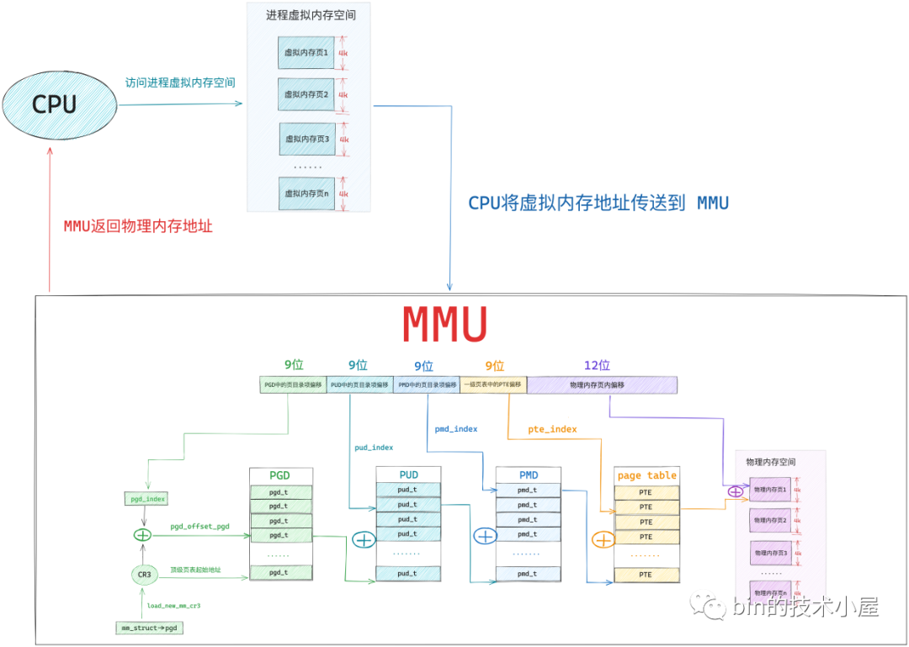
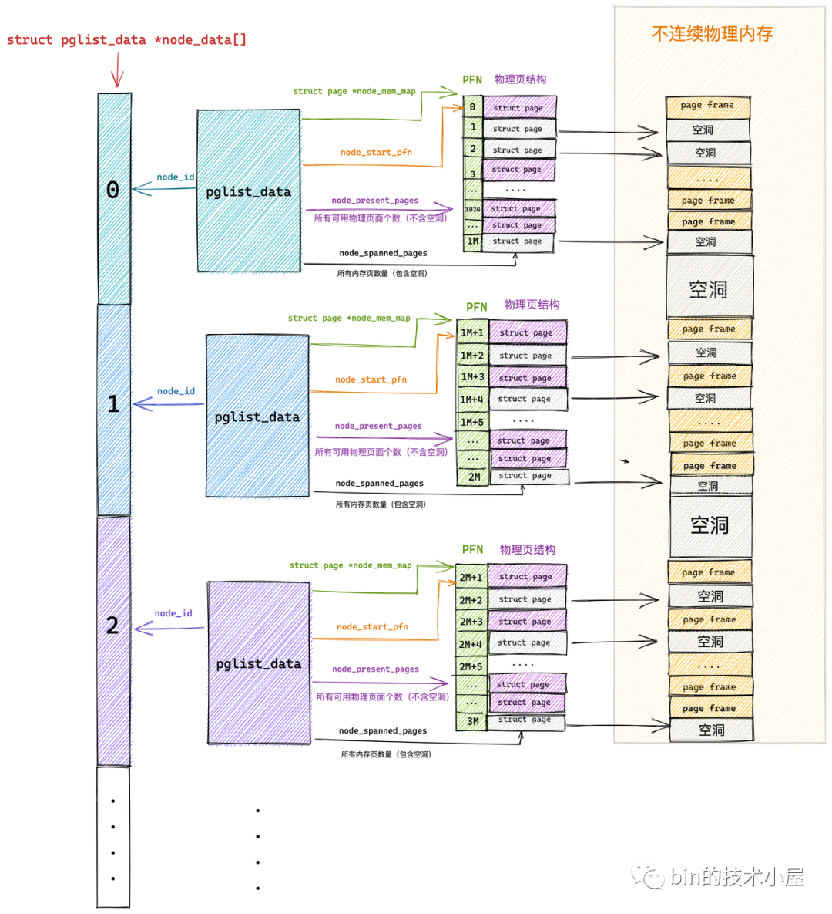

学linux 写点总结

<!--more-->

### 虚拟内存

进程描述符

```c
struct task_struct {
  // 进程id
  pid_t    pid;
  // 用于标识线程所属的进程 pid
  pid_t    tgid;
  // 进程打开的文件信息
  struct files_struct  *files;
  // 内存描述符表示进程虚拟地址空间
  struct mm_struct  *mm;

  // ...
}
```

其中`mm_struct`就是其虚拟内存的信息，`fork`时直接将子进程的指针指向父进程的资源，增加父进程资源的引用计数。

```c
struct mm_struct {
  unsigned long task_size; /* size of task vm space */
  unsigned long start_code, end_code, start_data, end_data;
  unsigned long start_brk, brk, start_stack;
  unsigned long arg_start, arg_end, env_start, env_end; /* 参数列表的起始和结束，环境变量的起始和结束，位于栈底*/
  unsigned long mmap_base; /* base of mmap area，动态链接区的起始，动态链接区向下（低地址）扩展，包括动态链接的程序的code, data, bss和mmap调用申请的地址 */
  unsigned long total_vm; /* Total pages mapped */
  unsigned long locked_vm; /* Pages that have PG_mlocked set，不能换出到硬盘的页数量*/
  unsigned long pinned_vm; /* Refcount permanently increased，不能换出到硬盘，也不能移动的页数量 */
  /* 各个段映射的页面总数 */
  unsigned long data_vm; /* VM_WRITE & ~VM_SHARED & ~VM_STACK */
  unsigned long exec_vm; /* VM_EXEC & ~VM_WRITE & ~VM_STACK */
  unsigned long stack_vm; /* VM_STACK */

  struct rb_root mm_rb; /* 红黑树的根节点 */

  // 当前进程顶级页表的虚拟起始地址，会在进程切换时调用 load_new_mm_cr3 函数转换虚拟地址为物理地址到 CR3 寄存器
  pgd_t * pgd;
  // ...
}
```

`vma`描述一个内存区域，例如各个段，在`malloc`申请的内存大于`128k`时创建的匿名映射（小于时直接移动堆顶指针）

```c
struct vm_area_struct {

  struct vm_area_struct *vm_next, *vm_prev; /* 链表的前驱后继 */
  struct rb_node vm_rb; /* 自己的红黑树节点 */
  struct list_head anon_vma_chain; 
  struct mm_struct *vm_mm; /* The address space we belong to. */
 
  unsigned long vm_start; /* Our start address within vm_mm. */
  unsigned long vm_end; /* The first byte after our end address within vm_mm. */

  /*
   * Access permissions of this VMA.
   */
  pgprot_t vm_page_prot;
  unsigned long vm_flags; /* 访问权限 */

  struct list_head anon_vma_chain;
  struct anon_vma *anon_vma; /* Serialized by page_table_lock，真正访问内存时发生缺页中断，才会建立和物理内存的双向映射 */
  struct file * vm_file; /* File we map to (can be NULL). */
  unsigned long vm_pgoff; /* Offset (within vm_file) in PAGE_SIZE units */ 
  void * vm_private_data; /* was vm_pte (shared mem) */
  const struct vm_operations_struct *vm_ops; /* Function pointers to deal with this struct. 类似某种虚函数*/
}
```

### 物理内存

一个单元存储一个字节，一个DRAM芯片控制一个矩阵的单元的读写，一条内存上的8个芯片分别控制64位内存的8个字节。

### 页表

物理内存被分为`4k`大小的页，通过`struct page`管理，每个`struct page`有全局唯一的`PFN`与之对应。`PageFrameNumber`通过最低级的页表管理，linux最多支持五层页表：`PGD->P4D->PUD->PMD->PTE`



### 进程切换

```c
/*
 * context_switch - switch to the new MM and the new thread's register state.
 */
static __always_inline struct rq *
context_switch(struct rq *rq, struct task_struct *prev,
           struct task_struct *next, struct rq_flags *rf)
{
  // ...

  if (!next->mm) { // to kernel
    // 每个进程都会拷贝一份内核的页表到自己的页表（若内核页表发生更改，会其他进程会在访问时发生缺页中断来同步。arm64 有专门的寄存器负责存储内核页表，无需拷贝），所以内核无需切换页表，直接将内核的 active_mm 指向系统调用的进程的 mm 即可
    // ........ 内核线程的切换

  } else { // to user
    // ........ 用户进程的切换

    membarrier_switch_mm(rq, prev->active_mm, next->mm);
    // 切换进程虚拟内存空间
    switch_mm_irqs_off(prev->active_mm, next->mm, next);
  }

  // 切换 CPU 上下文和进程栈
  switch_to(prev, next, prev);
  barrier();
  return finish_task_switch(prev);
}
```
### NUMA

```c
typedef struct pglist_data {
  // NUMA 节点id
  int node_id;
  // 指向 NUMA 节点内管理所有物理页 page 的数组
  struct page *node_mem_map;
  // NUMA 节点内第一个物理页的 pfn
  unsigned long node_start_pfn;
  // NUMA 节点内所有可用的物理页个数（不包含内存空洞）
  unsigned long node_present_pages;
  // NUMA 节点内所有的物理页个数（包含内存空洞）
  unsigned long node_spanned_pages; 
  // 保证多进程可以并发安全的访问 NUMA 节点
  spinlock_t node_size_lock;

  // ...
} // 一个 NUMA 节点
// 所有 NUMA 节点通过一个全局数组 node_data[] 组织起来
```



### 参考

1. bin的技术小屋.聊聊linux内核.[源地址.](https://mp.weixin.qq.com/mp/appmsgalbum?__biz=Mzg2MzU3Mjc3Ng==&action=getalbum&album_id=2559805446807928833&scene=173&from_msgid=&from_itemidx=&count=3&nolastread=1&scene=21#wechat_redirect)