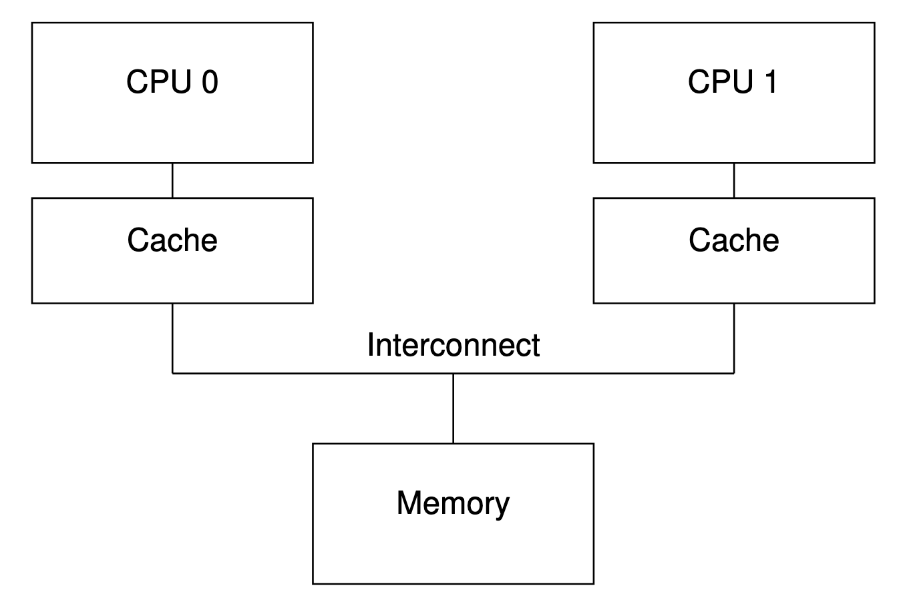
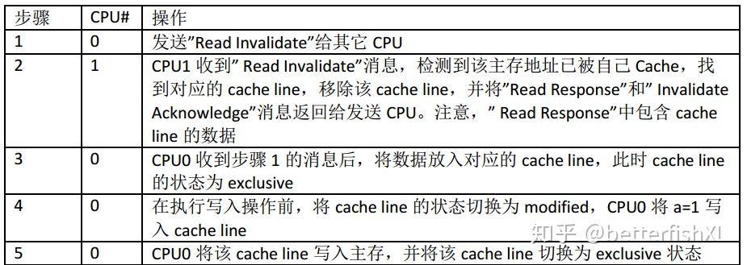
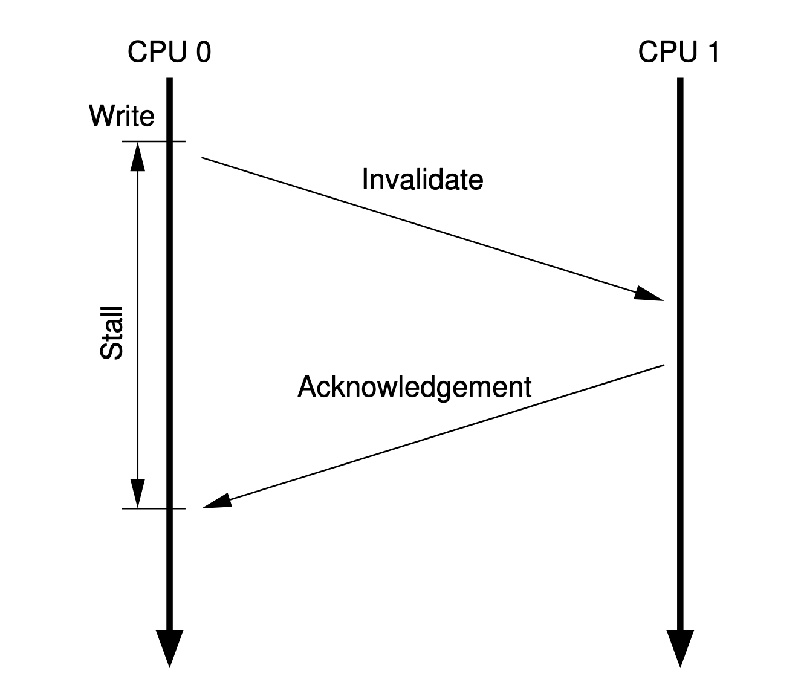
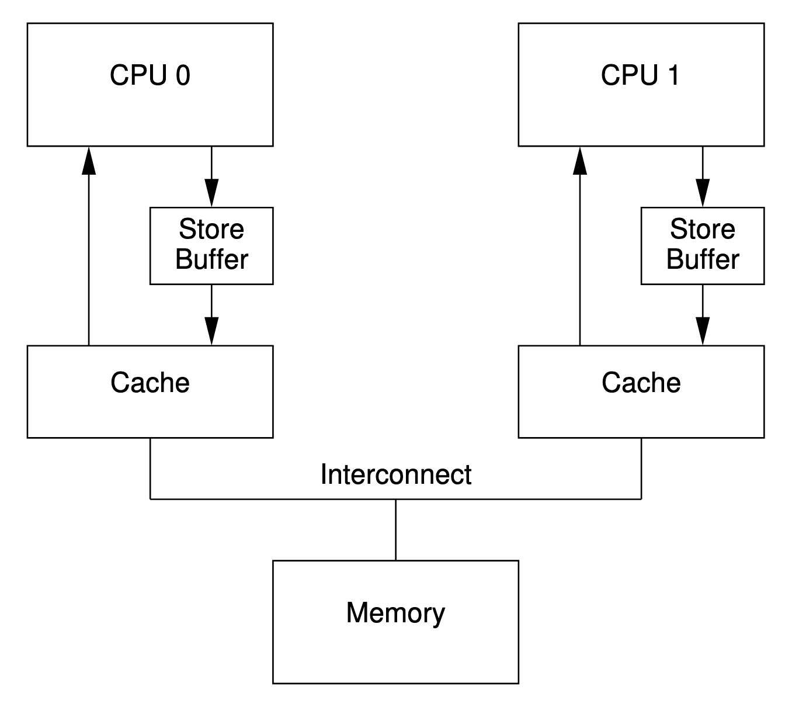
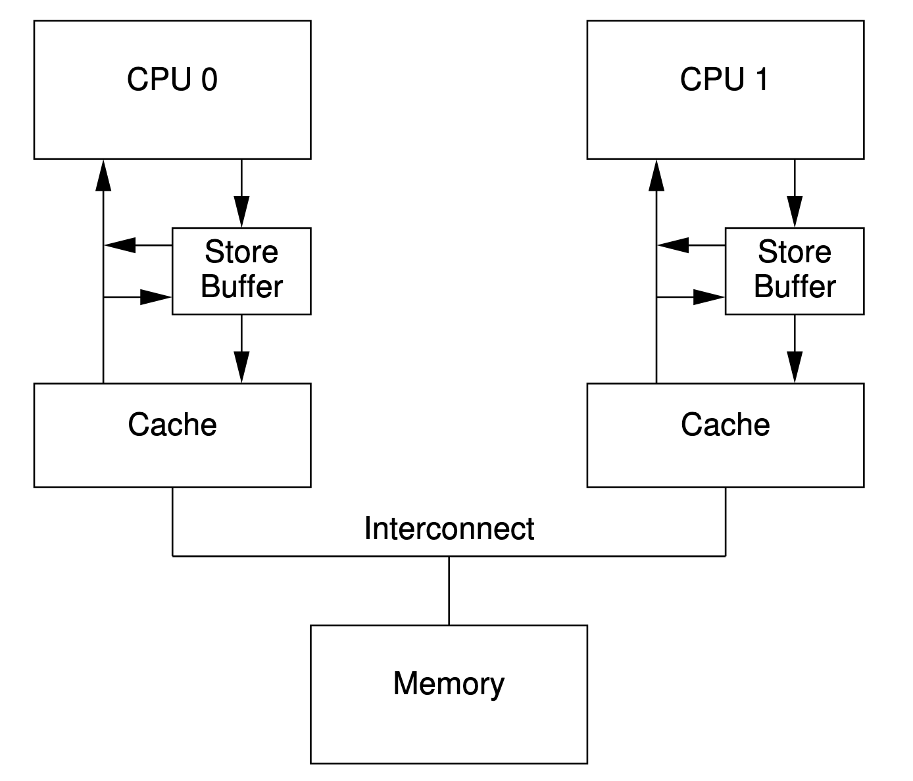
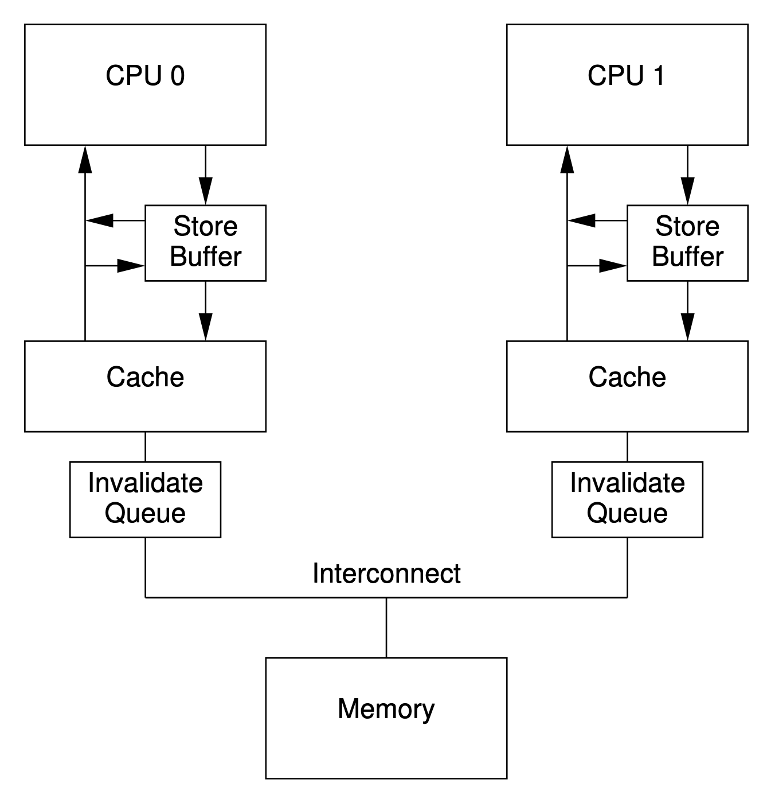

感觉这部分网上胡乱讲的太多了, 翻译也乱七八糟

<!--more-->

## 软件

### 概念

1. 与同步: 仅存在于对原子类型的操作中; 对一个变量的原子写就 *与* 对这个变量的原子读、原子读-改-写 *同步*, 意味着原子读读到的值会是与这个原子读同步的原子写所写下的值. 
2. 先发生: *先发生* 决定了一个操作能够看到哪些操作的影响. *先发生* 具有传递性. 
    在单线程操作中, A *(强)先发生* 于 B 等价于 A 在源码中先于 B 出现. 在同一条语句中的操作, 除逗号运算符和表达式求值等特殊情况, 互相没有 *先发生* 的关系. 
    在多线程操作中, 如果 A *线程间先发生* 于 B, 那么 A 就 *(强, 除非使用 `memory_order_consume`)先发生* 于 B. 
3. 线程间先发生: 如果 A *与* B *同步*, 那么 A *线程间先发生* 于 B. *线程间先发生* 具有传递性. 

### memory_order

总共有六种内存序, 代表了三种模型

1. 序列一致序: `memory_order_seq_cst`
2. 获取-发布序: `memory_order_consume`、`memory_order_acquire`、`memory_order_release`、`memory_order_acq_rel`
3. 宽松序: `memory_order_relaxed`

若无特殊制定, 默认使用 `memory_order_seq_cst`

模型 3 毫无疑问是额外消耗最小的, 不同架构的 CPU 对于模型 1、2 增加的额外消耗也不同. 对于 x86 和 x86\_64 除了需要保证原子性的操作, 模型 2 不会导致额外代价, 模型 1 不需要对 `load()` 操作做额外处理, 但 `store()` 需要增加少量成本. 

#### 序列一致序

若所有原子操作均采用 *序列一致序*, 则其行为就如同是在一个单线程的命令序列中顺序发生一样. 每个线程所看到的这些原子操作的顺序都是相同的. 

从同步的角度来看, 采用 *序列一致序* 的 `store()` *与* 采用 *序列一致序* 的 `load()` *同步*, 为多线程原子操作的 *发生* 顺序提供了约束(*发生* 在 `store()` 之后的操作 可以被确定为 *发生* 在与该 `store()` 同步的 `load()` 之后), 需要注意这种约束对使用 *宽松序* 原子操作的线程不起作用, 即这种线程依然可能观测到使用 *序列一致序* 的原子操作的发生是不同的顺序. 

在 *序列一致序* 下, 会有一个 所有采用该序的原子操作的 **全局发生顺序**, 在其他序列下就没有这种好东西了.

```cpp
#include <atomic>
#include <thread>
#include <assert.h>

std::atomic<bool> x,y;
std::atomic<int> z;

void write_x()
{
  x.store(true,std::memory_order_seq_cst);  // 1
}

void write_y()
{
  y.store(true,std::memory_order_seq_cst);  // 2
}
void read_x_then_y()
{
  while(!x.load(std::memory_order_seq_cst));
  if(y.load(std::memory_order_seq_cst))  // 3
    ++z;
}
void read_y_then_x()
{
  while(!y.load(std::memory_order_seq_cst));
  if(x.load(std::memory_order_seq_cst))  // 4
    ++z;
}
int main()
{
  x=false;
  y=false;
  z=0;
  std::thread a(write_x);
  std::thread b(write_y);
  std::thread c(read_x_then_y);
  std::thread d(read_y_then_x);
  a.join();
  b.join();
  c.join();
  d.join();
  assert(z.load()!=0);  // 5
}
```

assert 5 不可能触发, 因为要么 1 先发生, 要么 2 先发生, 但保证所有线程看到的 1、2 发生的顺序相同. 如果 3 返回 `false`, 那么 4 一定会返回 `true`, 反之亦然. 因此 `z` 不可能为 `0`. 

但在 `read_ _then_ ()` 中, `while` 和 `if` 中间并不保证不会有其他语句, 因此 `z` 的值可能为 `2`

#### 宽松序

宽松序下的原子操作不再有 *与同步* 的关系. **同一线程下对同一个变量**的操作依然拥有 *先发生* 的关系, 对其他线程的保证只有 **对该变量来自同一个线程的操作不会被重排; 在读到某个值后, *后发生*的操作不会再读到比这个值更早的操作后的值**

例 1

```cpp
#include <atomic>
#include <thread>
#include <assert.h>

std::atomic<bool> x,y;
std::atomic<int> z;

void write_x_then_y()
{
  x.store(true,std::memory_order_relaxed);  // 1
  y.store(true,std::memory_order_relaxed);  // 2
}
void read_y_then_x()
{
  while(!y.load(std::memory_order_relaxed));  // 3
  if(x.load(std::memory_order_relaxed))  // 4
    ++z;
}
int main()
{
  x=false;
  y=false;
  z=0;
  std::thread a(write_x_then_y);
  std::thread b(read_y_then_x);
  a.join();
  b.join();
  assert(z.load()!=0);  // 5
}
```

assert 5 有可能被触发. 在线程 `a` 中 `x` 的修改操作确实是 *强先发生* 于 `y`的修改操作, 在线程 `b` 中对 `y` 的最后一次 `load()`也确实是 *强先发生* 于对 `x` 的 `load()`.

但对于线程 `b` 来说, `x` 的修改对 `b` **可见** 并不一定先于 `y` 的修改(因为 `x` 和 `y` 不是同一个变量).


例 2

```cpp
#include <thread>
#include <atomic>
#include <iostream>

std::atomic<int> x(0),y(0),z(0);  // 1
std::atomic<bool> go(false);  // 2

unsigned const loop_count=10;

struct read_values
{
  int x,y,z;
};

read_values values1[loop_count];
read_values values2[loop_count];
read_values values3[loop_count];
read_values values4[loop_count];
read_values values5[loop_count];

void increment(std::atomic<int>* var_to_inc,read_values* values)
{
  while(!go)
    std::this_thread::yield();  // 3 自旋, 等待信号
  for(unsigned i=0;i<loop_count;++i)
  {
    values[i].x=x.load(std::memory_order_relaxed);
    values[i].y=y.load(std::memory_order_relaxed);
    values[i].z=z.load(std::memory_order_relaxed);
    var_to_inc->store(i+1,std::memory_order_relaxed);  // 4
    std::this_thread::yield();
  }
}

void read_vals(read_values* values)
{
  while(!go)
    std::this_thread::yield(); // 5 自旋, 等待信号
  for(unsigned i=0;i<loop_count;++i)
  {
    values[i].x=x.load(std::memory_order_relaxed);
    values[i].y=y.load(std::memory_order_relaxed);
    values[i].z=z.load(std::memory_order_relaxed);
    std::this_thread::yield();
  }
}

void print(read_values* v)
{
  for(unsigned i=0;i<loop_count;++i)
  {
    if(i)
      std::cout<<",";
    std::cout<<"("<<v[i].x<<","<<v[i].y<<","<<v[i].z<<")";
  }
  std::cout<<std::endl;
}

int main()
{
  std::thread t1(increment,&x,values1);
  std::thread t2(increment,&y,values2);
  std::thread t3(increment,&z,values3);
  std::thread t4(read_vals,values4);
  std::thread t5(read_vals,values5);

  go=true;  // 6 开始执行主循环的信号

  t5.join();
  t4.join();
  t3.join();
  t2.join();
  t1.join();

  print(values1);  // 7 打印最终结果
  print(values2);
  print(values3);
  print(values4);
  print(values5);
}
```

简单来说就是 3 个原子变量 `x, y, z` , 三个线程依次从 `1` 到 `10` 分别给三个变量赋值, 外加两个线程和之前的三个线程一起记录他们眼中的 `x, y, z` 分别是什么

一种可能的输出如下

```
(0,0,0),(1,0,0),(2,0,0),(3,0,0),(4,0,0),(5,7,0),(6,7,8),(7,9,8),(8,9,8),(9,9,10)
(0,0,0),(0,1,0),(0,2,0),(1,3,5),(8,4,5),(8,5,5),(8,6,6),(8,7,9),(10,8,9),(10,9,10)
(0,0,0),(0,0,1),(0,0,2),(0,0,3),(0,0,4),(0,0,5),(0,0,6),(0,0,7),(0,0,8),(0,0,9)
(1,3,0),(2,3,0),(2,4,1),(3,6,4),(3,9,5),(5,10,6),(5,10,8),(5,10,10),(9,10,10),(10,10,10)
(0,0,0),(0,0,0),(0,0,0),(6,3,7),(6,5,7),(7,7,7),(7,8,7),(8,8,7),(8,8,9),(8,8,9)
```

可以看到线程间的同步非常混乱, 不同线程对于"全局"的感知情况甚至相互冲突(牢记除了 `memory_order_seq_cst` 外的模型没有全局顺序), 但是线程内部仍然保持了准确的先后顺序


#### 获取-发布序

*获取-发布序* 依然没有全局顺序, 但是相较于 *宽松序* 引入了一些同步操作.

在这一序下, `load()` 是获取操作(`memory_order_acquire`); `store()` 是发布操作(`memory_order_release`); 读改操作如 `fetch_add(), exchange()` 既可能是获取操作, 也可能是发布操作, 或者二者皆有(`memory_order_acq_rel`)

同步发生在成对的获取和发布线程之间, 一个变量的**发布**操作 *与* **获取**这个变量的操作 *同步*. 不同线程依旧可能看到不同的"全局"顺序, 但遵从这种同步操作.

例 1

```cpp
#include <atomic>
#include <thread>
#include <assert.h>

std::atomic<bool> x,y;
std::atomic<int> z;
void write_x()
{
  x.store(true,std::memory_order_release);
}
void write_y()
{
  y.store(true,std::memory_order_release);
}
void read_x_then_y()
{
  while(!x.load(std::memory_order_acquire));
  if(y.load(std::memory_order_acquire))  // 1
    ++z;
}
void read_y_then_x()
{
  while(!y.load(std::memory_order_acquire));
  if(x.load(std::memory_order_acquire))  // 2
    ++z;
}
int main()
{
  x=false;
  y=false;
  z=0;
  std::thread a(write_x);
  std::thread b(write_y);
  std::thread c(read_x_then_y);
  std::thread d(read_y_then_x);
  a.join();
  b.join();
  c.join();
  d.join();
  assert(z.load()!=0); // 3
}
```

assert 3 有可能被触发. 因为有可能 1 观测到的是 `x = true, y = false`, 而 2 观测到的是 `y = true, x = false`. 因为没有全局顺序, 所以两个变量可以拥有这种冲突的观测结果


例 2

```cpp
#include <atomic>
#include <thread>
#include <assert.h>

std::atomic<bool> x,y;
std::atomic<int> z;

void write_x_then_y()
{
  x.store(true,std::memory_order_relaxed);  // 1 
  y.store(true,std::memory_order_release);  // 2
}
void read_y_then_x()
{
  while(!y.load(std::memory_order_acquire));  // 3 自旋, 等待y被设置为true
  if(x.load(std::memory_order_relaxed))  // 4
    ++z;
}
int main()
{
  x=false;
  y=false;
  z=0;
  std::thread a(write_x_then_y);
  std::thread b(read_y_then_x);
  a.join();
  b.join();
  assert(z.load()!=0);  // 5
}
```

assert 5 不可能触发, 因为现在对 `x` 的 `store()` 和对 `y` 的 `store()` 在同一个线程中, 1 *先发生*于 2; 而 2 是 `memory_order_release`, 因此 *与* 3 (`memory_order_acquire`) *同步*, 即 *先发生* 于最后一次 3 (即能观测到 2 的修改); 因此 1 一定先于 4 发生(3, 4 在同一线程中, 3 *先发生* 于 4).

例 3

```cpp
std::atomic<int> data[5];
std::atomic<bool> sync1(false),sync2(false);

void thread_1()
{
  data[0].store(42,std::memory_order_relaxed);
  data[1].store(97,std::memory_order_relaxed);
  data[2].store(17,std::memory_order_relaxed);
  data[3].store(-141,std::memory_order_relaxed);
  data[4].store(2003,std::memory_order_relaxed);
  sync1.store(true,std::memory_order_release);  // 1.设置sync1
}

void thread_2()
{
  while(!sync1.load(std::memory_order_acquire));  // 2.直到sync1设置后, 循环结束
  sync2.store(true,std::memory_order_release);  // 3.设置sync2
}
void thread_3()
{
  while(!sync2.load(std::memory_order_acquire));   // 4.直到sync1设置后, 循环结束
  assert(data[0].load(std::memory_order_relaxed)==42);
  assert(data[1].load(std::memory_order_relaxed)==97);
  assert(data[2].load(std::memory_order_relaxed)==17);
  assert(data[3].load(std::memory_order_relaxed)==-141);
  assert(data[4].load(std::memory_order_relaxed)==2003);
}
```

assert 均不会触发, 由于在同一个线程中, `sync1` 的 `store(release)` *后发生* 于 `data` 的 `store(relaxed)`; 且 `thread_1` 对 `sync1` 的 `store(release)` 与 `thread_2` 对 `sync1` 的 `load(acquire)` 构成了一对 *获取-发布* 关系, 即 `sync1` 的 `store(releas)` 发生在 2 的最后一次循环之前. 即 *先发生* 于 `sync2` 的 `store(release)`.

以此类推, `data` 的 `store(relaxed)` *先发生* 于 `sync1` 的 `store(release)`, *先发生* 于 `sync2` 的 `store(release)`, *先发生* 于 `sync2` 的最后一次 `load(acquire)`, 即先发生于 `data` 的 `load(relaxed)`. 因而获得的数据均为写入的数据, 不会触发 assert

上面的例子等价于使用读-改-写操作的如下代码

```cpp
std::atomic<int> sync(0);
void thread_1()
{
  // ...
  sync.store(1,std::memory_order_release);
}

void thread_2()
{
  int expected=1;
  while(!sync.compare_exchange_strong(expected,2,
              std::memory_order_acq_rel))
    expected=1;
}
void thread_3()
{
  while(sync.load(std::memory_order_acquire)<2);
  // ...
}
```

#### memory_order_consume

`memory_order_consume` 很特殊, 且被 C++17 建议不要使用

其引入了一个新概念 *数据依赖*: 如果操作 A 依赖于操作 B 的结果, 则操作 A *数据依赖* 于操作 B

`memory_order_consume` 只保证有依赖关系的数据的同步

例 1

```cpp
struct X
{
int i;
std::string s;
};

std::atomic<X*> p;
std::atomic<int> a;

void create_x()
{
  X* x=new X;
  x->i=42;
  x->s="hello";
  a.store(99,std::memory_order_relaxed);  // 1
  p.store(x,std::memory_order_release);  // 2
}

void use_x()
{
  X* x;
  while(!(x=p.load(std::memory_order_consume)))  // 3
    std::this_thread::sleep(std::chrono::microseconds(1));
  assert(x->i==42);  // 4
  assert(x->s=="hello");  // 5
  assert(a.load(std::memory_order_relaxed)==99);  // 6
}

int main()
{
  std::thread t1(create_x);
  std::thread t2(use_x);
  t1.join();
  t2.join();
}
```

assert 4、5 都不会触发, 因为 2 *数据依赖* 于 `x` 的值被正确设置, 因此当 `p` 被设置对 `use_x` 可见时, `x` 的值也对 `use_x` 可见.

但 assert 6 有可能触发, 因为 `consume` 并不保证可以看到没有依赖关系的变量保持正确的顺序.

为了优化代码速度, 甚至可以显示的打破不需要的依赖关系, 以避免进行同步而耗费时间

```cpp
int global_data[]={ … };
std::atomic<int> index;

void f()
{
  int i=index.load(std::memory_order_consume);
  do_something_with(global_data[std::kill_dependency(i)]);
}
```

当然 这些现在都不推荐使用了


### 栅栏

类似于获取-发布序

```cpp
#include <atomic>
#include <thread>
#include <assert.h>

std::atomic<bool> x,y;
std::atomic<int> z;

void write_x_then_y()
{
  x.store(true,std::memory_order_relaxed);  // 1
  std::atomic_thread_fence(std::memory_order_release);  // 2
  y.store(true,std::memory_order_relaxed);  // 3
}

void read_y_then_x()
{
  while(!y.load(std::memory_order_relaxed));  // 4
  std::atomic_thread_fence(std::memory_order_acquire);  // 5
  if(x.load(std::memory_order_relaxed))  // 6
    ++z;
}

int main()
{
  x=false;
  y=false;
  z=0;
  std::thread a(write_x_then_y);
  std::thread b(read_y_then_x);
  a.join();
  b.join();
  assert(z.load()!=0);  // 7
}
```

现在 assert 7 不会触发, 2 实际上就相当于将 3 的 tag 改为 `memory_order_release`; 5 实际上就相当于将 4 的 tag 改为 `memory_order_acquire`

唯一的区别就是同步点在 `fence` 自己, 所以如果改成下面这种 assert 7 就有可能触发了

```cpp
void write_x_then_y()
{
  std::atomic_thread_fence(std::memory_order_release);
  x.store(true,std::memory_order_relaxed);
  y.store(true,std::memory_order_relaxed);
}
```

`fence` 对非原子操作依旧生效

```cpp
#include <atomic>
#include <thread>
#include <assert.h>

bool x=false;  // x现在是一个非原子变量
std::atomic<bool> y;
std::atomic<int> z;

void write_x_then_y()
{
  x=true;  // 1 在栅栏前存储x
  std::atomic_thread_fence(std::memory_order_release);
  y.store(true,std::memory_order_relaxed);  // 2 在栅栏后存储y
}

void read_y_then_x()
{
  while(!y.load(std::memory_order_relaxed));  // 3 在#2写入前, 持续等待
  std::atomic_thread_fence(std::memory_order_acquire);
  if(x)  // 4 这里读取到的值, 是#1中写入
    ++z;
}
int main()
{
  x=false;
  y=false;
  z=0;
  std::thread a(write_x_then_y);
  std::thread b(read_y_then_x);
  a.join();
  b.join();
  assert(z.load()!=0);  // 5 断言将不会触发
}
```


## 硬件

内容屌多, 先抄一点 perfbook 附录 C 的翻译, 有时间再说

### 缓存

现在的 CPU 大多有 3 级缓存: L1(还可以分为 L1I 一级指令缓存和 L1D 一级数据缓存), L2, L3(CPU核间共享)

CPU 缓存和内存之间的数据流是固定长度的块, 称为“缓存行”, 其大小通常是 2 的 N 次方. 

可以通过查看文件和 `getconf` 查看缓存行大小

```bash
# L1D Cache
cat /sys/devices/system/cpu/cpu0/cache/index0/coherency_line_size

# L1I Cache
cat /sys/devices/system/cpu/cpu0/cache/index1/coherency_line_size

# L2 Cache
cat /sys/devices/system/cpu/cpu0/cache/index2/coherency_line_size

# L3 Cache
cat /sys/devices/system/cpu/cpu0/cache/index3/coherency_line_size

# L1D Cache
getconf LEVEL1_DCACHE_LINESIZE

# L1I Cache
getconf LEVEL1_ICACHE_LINESIZE

# L2 Cache
getconf LEVEL2_CACHE_LINESIZE

# L3 Cache
getconf LEVEL3_CACHE_LINESIZE
```

考虑最简单的缓存模型, 我们在后面不断优化他



### 一种缓存一致性协议 MESI

Intel x86 用的就是 MESI 协议, 他将每个缓存行分为四种状态:

1. modified: 该行被本 CPU 修改, 且相应内存没有在其他 CPU 的缓存中出现; 可以被认为被本 CPU "拥有", 有责任在缓存其他数据之前将其写回内存, 为其他缓存提供数据
2. exclusive: 该行未被本 CPU 修改, 且相应内存没有在其他 CPU 的缓存中出现; 也可以被认为是被本 CPU "拥有", 但可以直接丢弃而不用写回内存或为其他缓存提供数据
3. shared: 该行可能在其他 CPU 的缓存中存在; 因此在没有得到其他 CPU 的许可前不能向其写入数据, 可以认为其数据是最新的, 且可以直接丢弃
4. invalid: 该行没有有效数据; 新缓存的数据会优先缓存到该行以减少 miss 的发生

协议在每一行缓存的物理地址和数据后面维护一个两个位的标记以确定该行处在哪个状态

CPU 和内存通过总线(BUS)互通消息. CPU 通过嗅探(Snoop)总线中其他 CPU 发出的请求消息, 感知其他 CPU 的行为(比如读、写某个缓存行), 有时 CPU 也需要针对总线中的某些请求消息进行响应. 这被称为"总线嗅探机制". 

这些消息类型分为请求消息和响应消息两大类, 细分为6小类. 


| 消息类型 | 请求/响应 | 描述 |
|-------|-------|-------|
| Read | 请求 | 通知其他处理器和内存, 当前处理器准备读取某个数据. 该消息内包含待读取数据的内存地址 |
| Read Response | 响应 | 该消息内包含了被请求读取的数据. 该消息可能是主内存返回的, 也可能是其他高速缓存嗅探到 Read 消息返回的; 收到该消息的 CPU 会将数据放入自身的缓存中 |
| Invalidate | 请求 | 包含一个主存地址, 通知其他处理器删除指定内存地址的数据副本(缓存行中的数据). 所谓"删除", 其实就是更新缓存行对应的 FLAG 将其置为 invalid |
| Invalidate Acknowledge | 响应 | 接收到 Invalidate 消息的处理器必须回复此消息, 表示已经删除了其高速缓存内对应的数据副本 |
| Read Invalidate | 请求 | 此消息为 Read 和 Invalidate 消息组成的复合消息, 主要是用于通知其他处理器当前处理器准备更新一个数据了, 并请求其他处理器删除其高速缓存内对应的数据副本. 接收到该消息的处理器必须回复 Read Response 和 Invalidate Acknowledge 消息 |
| Writeback | 响应| 消息包含了需要写入内存的数据和其对应的内存地址; 该消息仅在缓存行状态为 modified 时发出, 写回后该行便可以被移除以用于缓存其他数据 |

#### 原始

例 1: 假设变量 `a` 的初值为 `0` 且在 CPU1 的 cache 中, 现在 CPU0 要对 `a` 进行写入值为 `1` 的操作. 

其步骤如下



CPU0 对 `a` 进行写入操作, 按理说无需知道 `a` 的初值, 为什么还要发送 "Read" 消息呢？因为 cache line 中不止是包含 `a` 的数据, 例如 cache line 有 256 字节而 `a` 可能只有 4 字节, 写 a 不能使同数据块的其它值受影响(读写内存是成行操作的). 

可以发现上述步骤 2 中 CPU0 在等待 CPU1 的同步, 发生了不必要的等待(无论 CPU1 同步的数据是什么, CPU0 都会覆盖他)



#### 加入存储缓冲区

我们发现如果一个 CPU 只进行无条件的写操作, 那么就无需等待其他 CPU 的同步数据. 考虑到写入的变量通常比一整个缓存行要小得多, 我们可以为这些操作增加一个 store buffer 作为缓存的缓冲. 在上个例子中就是 CPU0 先写入到 store buffer 中, 等到 CPU1 的相应数据到达 CPU0 后再将 store buffer 中的数据写入到缓存中



这种方法并非完美, 考虑让 CPU0 执行如下代码, 初始情况假定 `a` 和 `b` 都为 `0`, 且 `a` 在 CPU1 的 cache line 中, 而 `b` 在 CPU0 的 cache line 中. 

```cpp
// Listing 5.1
a = 1;
b = a + 1;
assert(b == 2);
```

可能会产生如下的执行:

1. CPU0 开始执行 `a = 1`. 
2. CPU0 发现 `a` 已经在 CPU1 的缓存中. 
3. 因此, CPU0 发送一个"读使无效"消息, 以获得包含“a”的独享缓存行. 
4. CPU0 将 `a = 1` 记录到存储缓冲区. 
5. CPU1 接收到"读使无效"消息, 它通过发送缓存行数据, 并从它的缓存行中移除数据来响应这个消息. 
6. CPU0 开始执行 `b = a + 1`. 
7. CPU0 从 CPU1 接收到缓存行, 它仍然得到一个为 `0` 的 `a` 值. 
8. CPU0 从它的缓存中读取到 `a` 的值, 发现其值为 `0`. 
9. CPU0 将存储队列中的条目应用到缓存行, 设置缓存行中的 `a` 的值为 `1`. 
10. CPU0 将值 `0` 加 `1`, 并存储该值到包含 `b` 的缓存行中 (假设已经包含在 CPU0 的缓存行中). 
11. CPU0 执行 `assert(b == 2)`, 并引起错误. 

主要问题在于存在两个 `a`, 一个在存储缓冲中, 一个在缓存中. 因此需要 store forwarding 让 CPU 在载入数据时同时查看缓存和存储缓冲, 这样就保证了**同一个 CPU 的顺序性**(可以看到自己先前执行而未放入缓存中的操作)



单 CPU 的问题解决了, 考虑多 CPU

初始情况假定 `a` 和 `b` 都为 `0`, 且 `a` 在 CPU1 的 cache line 中, 而 `b` 在 CPU0 的 cache line 中. CPU0 执行 `foo()`, CPU1 执行 `bar()`

```cpp
// Listing 6.1
void foo()
{
    a = 1;
    b = 1;
}
void bar() 
{
    while(b == 0) continue;
    assert(a == 1);
}
```

一种可能的执行顺序如下:

1. CPU0 执行 `a = 1`. 缓存行不在 CPU0 的缓存中, 因此 CPU0 将 `a = 1` 放到存储缓冲区, 并发送一个"读使无效"消息. 
2. CPU1 执行 `while (b == 0) continue`, 但是包含 `b` 的缓存行不在缓存中, 它发送一个"读"消息. 
3. CPU0 执行 `b = 1`, 它已经在缓存行中有 `b` 的值了 (换句话说, 缓存行已经处于 "modified" 或者 "exclusive" 状态), 因此它存储新的 `b` 值在它的缓存行中. 
4. CPU0 接收到"读"消息, 并且发送缓存行中的最新的 `b` 的值到 CPU1, 同时将缓存行设置为 "shared" 状态. 
5. CPU1 接收到包含 `b` 值的缓存行, 并将其值写到它的缓存行中. 
6. CPU1 现在结束执行 `while (b == 0) continue`, 因为它发现 `b` 的值是 `1`, 它开始处理下一条语句. 
7. CPU1 执行 `assert(a == 1)`, 并且, 由于 CPU1 工作在旧的 `a` 的值, 因此验证失败. 
8. CPU1 接收到“读使无效”消息, 并且发送包含 `a` 的缓存行到 CPU0, 同时使它的缓存行变成无效. 但是已经太迟了. 
9. CPU0 接收到包含 `a` 的缓存行, 将且将存储缓冲区的数据保存到缓存行中

从 CPU1 的角度来看, CPU0 的指令发生了重排, 但从 CPU0 的角度并没有; 本质在于 `a, b` 两个变量的"写入"并不相同, 一个只是写入了存储缓冲区, 而另一个写入了缓存行

为解决这个问题, 我们引入了**内存屏障**: 他要求在其后的语句写入缓存行之前, 要先将他前面的在存储缓冲区中的语句处理完成

为满足内存屏障的要求, CPU 有两种策略: 一种是遇到内存屏障后立即处理存储缓冲区中的操作; 一种是把屏障之后的语句也写入存储缓冲区中, 直到必须要写入缓存行中才将所有缓冲区中的操作一起处理完成.

```cpp
// Listing 6.2
void foo()
{ 
    a = 1;
    smp_mb(); // 内存屏障
    b = 1;
}
void bar() 
{
    while(b == 0) continue;
    assert(a == 1);
}
```

加入内存屏障后执行的顺序可能如下:

1. CPU0 执行 `a = 1`. 缓存行不在 CPU0 的缓存中, 因此 CPU0 将 `a` 的新值放到存储缓冲中, 并发送一个"读使无效"消息. 
2. CPU1 执行 `while (b == 0) continue`, 但是包含 `b` 的缓存行不在缓存中, 因此它发送一个"读"消息. 
3. CPU0 执行 `smp_mb()`, 并标记当前所有存储缓冲区的条目.  (也就是说 `a = 1` 这个条目). 
4. CPU0 执行 `b = 1`. 它已经拥有这个缓存行了. (也就是说, 缓存行已经处于 "modified"或者 "exclusive" 状态), 但是在存储缓冲区中存在一个标记条目. 因此, 它不将新值存放到缓存行, 而是存放到存储缓冲区中. (但是 `b` 不是一个标记条目). 
5. CPU0 接收到"读"消息, 随后发送包含 `b` 值的缓存行给 CPU1. 它也标记本地缓存行为 "shared" 状态. 
6. CPU1 读取到包含 `b` 的缓存行, 并将它复制到本地缓存中. 
7. CPU1 现在可以装载 `b` 的值了, 但是发现它的值仍然为 `0`, 因此它重复该语句. `b` 的新值被安全的隐藏在 CPU0 的存储缓冲区中. 
8. CPU1 接收到"读使无效"消息, 并且发送包含 `a` 的缓存行给 CPU0, 并且使它的缓存行无效. 
9. CPU0 接收到包含 `a` 的缓存行, 并且使用存储缓冲区的值替换缓存行, 使之进入 "modified" 状态. 
10. 由于被存储的 `a` 是存储缓冲区中唯一被 `smp_mb()` 标记的条目, 因此CPU0 也能够存储 `b` 的新值到缓存行中—除非包含 `b` 的缓存行处于 "shared" 状态. 
11. CPU0 发送一个"使无效"消息给 CPU1. 
12. CPU1 接收到"使无效"消息, 使包含 `b` 的缓存行变为无效, 并且发送一个"使无效应答"消息给 CPU0. 
13. CPU1 执行 `while (b == 0) continue`, 但是包含 `b` 的缓存行不在缓存中, 因此它发送一个"读"消息给 CPU0. 
14. CPU0 接收到"使无效应答"消息, 将包含 `b` 的缓存行设置成 "exclusive" 状态.  CPU0 现在存储新的 `b` 值到缓存行. 
15. CPU0 接收到"读"消息, 同时发送包含新的 `b` 值的缓存行给 CPU1. 它也标记该缓存为 "shared". 
16. CPU1 接收到包含 `b` 的缓存行, 并将它复制到本地缓存中. 
17. CPU1 现在能够装载 `b` 的值了, 由于它发现 `b` 的值为 `1`, 它退出循环并执行下一条语句. 
18. CPU1 执行 `assert(a == 1)`, 但是包含 `a` 的缓存行不在它的缓存中. 一旦它从 CPU0 获得这个缓存行, 它将使用最新的 `a` 的值, 验证语句将通过. 

#### 加入使无效队列

store buffer 大小很有限, 若 store buffer 已满, 则再进行写入操作就需要等待其他 CPU 的 Invalidate Acknowledge 了, 相当于又退化了

而此时其他 CPU 可能正在将 store buffer 中的操作执行到 cache line 中, 导致无法及时返回 Invalidate Acknowledge, 这不仅是退化了, 甚至比之前还要劣化了

因此引入 invalidate queue (如下图)



CPU 在收到 Invalidate 消息后不立即执行, 而是放入使无效队列中, 并直接返回 Invalidate Acknowledge; 而在需要对外发送 Invalidate 请求时, 则需先检查队列中有无其他 CPU 对该条缓存行的 Invalidate 请求, 若有, 则先处理, 再继续执行(需要对外发送"使无效"说明该 CPU 试图修改该行)

加入使无效队列后执行代码 6.2, 假设 `a` 和 `b` 被初始化为 `0`,  `a`是只读的(MESI "shared" 状态), `b` 被 CPU0 拥有 (MESI "exclusive" 或者 "modified" 状态). 然后假设 CPU0 执行 `foo()` 而 CPU1 执行 `bar()`, 一种可能的顺序如下:

1. CPU0 执行 `a = 1`. CPU0 中相应的缓存行是只读的, 因此 CPU0 将 `a` 的新值放入存储缓冲区, 并发送一个"使无效"消息, 这是为了使 CPU1 的缓存中相应的缓存行失效. 
2. CPU1 执行 `while (b == 0) continue`, 但是包含 `b` 的缓存行不在缓存中, 因此它发送一个"读"消息. 
3. CPU1 接收到 CPU0 的"使无效"消息, 将它排队, 并立即返回"使无效响应"消息. 
4. CPU0 接收到来自于 CPU1 的响应消息, 因此它放心的通过第 5 行的smp_mb(), 从存储缓冲区移动 `a` 的值到缓存行. 
5. CPU0 执行 `b = 1`. 它已经拥有这个缓存行(缓存行已经处于"modified"或者"exclusive"状态), 因此它将 `b` 的新值存储到缓存行中. 
6. CPU0 接收到"读"消息, 并且发送包含 `b` 的新值的缓存行到 CPU1, 也标记缓存行为 "shared" 状态. 
7. CPU1 接收到包含 `b` 的缓存行并且将其应用到本地缓存. 
8. CPU1 现在执行完 `while (b == 0) continue`, 因为它发现 `b` 的值为 `1`, 接着处理下一条语句. 
9. CPU1 执行 `assert(a == 1)`, 由于旧的“a”值还在 CPU1 的缓存中, 因此陷入错误. 
10. 虽然陷入错误, CPU1 仍然会继续处理先前已经排队的"使无效"消息, 并且刷新包含 `a` 值的缓冲行. 

即使加入了内存屏障, CPU1 眼中的 CPU0 依然发生了命令重排, 原因在于二者对"使无效"的理解不同: CPU0 收到 CPU1 的"使无效"相应后认为 CPU1 的缓存行中已经不存在 `a` 了, 而 CPU1 仅仅是把 Invalidate 放进了 invalidate queue 中, 而没有对 cache 做任何操作.

为解决这个问题, 可以在代码 6.2 中再加入一个内存屏障

```cpp
// Listing 7.1
void foo()
{ 
    a = 1;
    smp_mb();
    b = 1;
}
void bar() 
{
    while(b == 0) continue;
    smp_mb();
    assert(a == 1);
}
```

以相同的条件执行, 一种可能的顺序如下

1. CPU0 执行 `a = 1`. 相应的缓存行在 CPU0 的缓存中是 "shared" 只读的, 因此CPU0 将 `a` 的新值放入它的存储缓冲区, 并且发送一个"使无效"消息以刷新 CPU1 的缓存. 
2. CPU1 执行 `while (b == 0) continue`, 但是包含 `b` 的缓存行不在它的缓存中, 因此它发送一个"读"消息. 
3. CPU1 接收到 CPU0 的"使无效"消息, 将它排队, 并立即返回"使无效响应"消息. 
4. CPU0 接收到 CPU1 的响应, 将 `a` 的缓存行标志位改为 "exclusive", 并将 `a` 从它的存储缓冲区移到缓存行以通过 `smp_mb()` 语句. 
5. CPU0 执行 `b = 1`. 它已经拥有缓存行(换句话说, 缓存行处于 "modified" 或者 "exclusive" 状态), 因此它存储 `b` 的新值到缓存行. 
6. CPU0 接收"读"消息, 并且发送包含新的 `b` 值的缓存行给 CPU1, 同时标记缓存行为 "shared" 状态. 
7. CPU1 接收到包含 `b` 的缓存行并更新到它的缓存中. 
8. CPU1 现在结束执行 `while (b == 0) continue`, 因为它发现 `b` 的值为 `1`. 它处理下一条语句, 一条内存屏障指令. 
9. CPU1 必须延迟, 直到它处理使无效队列中的所有消息. 
10. CPU1 处理已经入队的"使无效"消息, 从它的缓存中使无效包含 `a` 的缓存行. 
11. CPU1 执行 `assert(a == 1)`, 由于包含 `a` 的缓存行已经不在它的缓存中, 它发送一个"读"消息. 
12. CPU0 响应"读"消息, 发送它的包含新的 `a` 值的缓存行. 
13. CPU1 接收到缓存行, 它包含新的 `a` 的值 `1`, 因此不会陷入失败. 

内存屏障带来了额外的同步(让 CPU1 中 `a` 的缓存失效了, 迫使其与 CPU0 通信以获得新的 `a` 值), 带来了更多的消耗, 但是保证了正确性

有些 CPU 提供了更为细分的内存屏障, 包括 "read memory barrier" 和 "write memory barrier", 前者只会处理 invalidate queue, 而后者只会处理 store buffer, 其函数可分别记为 `smp_rmb()` 和 `smp_wmb()`. 显然, 只处理其中之一肯定比同时处理二者效率要高, 当然, 约束就更少, 可能的行为也就越多. 对于代码 7.1, 我们可以将 `foo()` 和 `bar()` 中的 `smp_mb()` 分别替换为 `smp_wmb()` 和 `smp_rmb()` 而不影响正确性.
